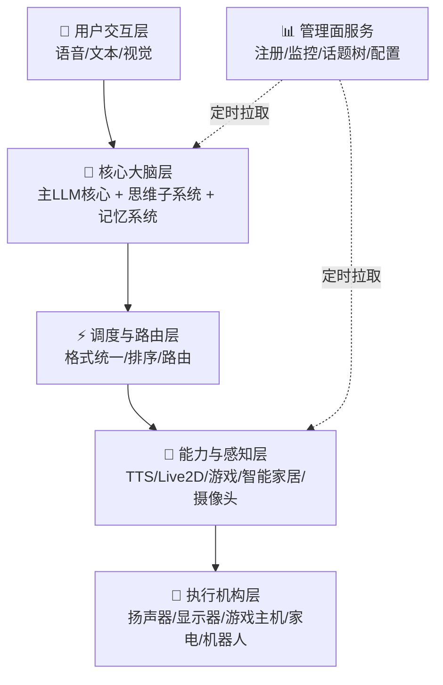

# 聆雪AI - Lucenette

> **设计哲学**：*She listens like snow. She connects like a net.*

   

> 📖 English introduction: [README_EN.md](./README_EN.md)

---

> ⚠️ **项目现状声明**：本项目当前处于**设计阶段**。完整架构已文档化（见 [docs/](docs/)），但**全部功能模块尚未实现**（仓库中的少量代码为早期原型测试脚本，不代表最终实现，后续将整体重写）。欢迎阅读设计文档、参与方案讨论，或领取工作包参与实现。

## 这是什么

聆雪 Lucenette 是一个以大语言模型为核心大脑、以分布式调度网络为神经系统、以即插即用设备抽象为感官与肢体、以管理面服务为运维中枢的**通用智能体操作系统**。其设计目标并非复刻一个简单的聊天机器人，而是构建一个具备**主动思考能力、多模态交互能力、动态环境感知与设备操控能力、自我监控与异常恢复能力**的数字生命系统。

核心设计：

- **双核架构**：显意识（主LLM核心，事件驱动）+ 潜意识（思维子系统，24小时后台思考），赋予系统主动性；
- **言行一致**：一次推理同时输出对话文本与控制标签，从源头保证多模态输出对齐；
- **万物皆插件**：所有能力（含内置函数、物理设备、MCP插件）统一注册、可运行时开关；
- **分层末端自治**：中间调度器只做路由，末端调度器自带执行与仲裁，设备即插即用；
- **管理不侵入**：管理面服务单向定时拉取，不影响实时交互链路。

## 总体架构

完整架构框图见 [docs/00-global/architecture-overview.md](docs/00-global/architecture-overview.md)。

## 实现状态

| 模块 | 设计文档 | 实现状态 |
|------|:---:|:---:|
| 00 全局共识（术语/原则/总架构/技术栈） | ✅ 初稿 | — |
| 01 跨模块契约 | 🚧 部分初稿 | — |
| M01 用户交互层 | ✅ 初稿 | ⬜ 未实现 |
| M02 主LLM核心 | ✅ 初稿 | ⬜ 未实现 |
| M03 思维子系统 | ✅ 初稿 | ⬜ 未实现 |
| M04 记忆系统 | 🚧 仅占位 | ⬜ 未实现 |
| M05 调度与路由层 | ✅ 初稿 | ⬜ 未实现 |
| M06 能力插件（TTS / Live2D / 游戏 / 智能家居） | 🚧 部分初稿 | ⬜ 未实现 |
| M07 执行机构层 | 🚧 仅占位 | ⬜ 未实现 |
| M08 管理面服务 | ✅ 初稿 | ⬜ 未实现 |
| M09 异常处理与健康巡检 | ✅ 初稿 | ⬜ 未实现 |

> 图例：✅ 已有初稿 · 🚧 占位/待细化 · ⬜ 未开始。唯一状态源为 [docs/04-delivery/work-packages.md](docs/04-delivery/work-packages.md)。

## 文档导航

| 路径 | 内容 |
|------|------|
| [docs/index.md](docs/index.md) | 文档站首页（状态矩阵 + 完整导航） |
| [docs/00-global/](docs/00-global/) | 术语表、设计原则、总体架构、技术栈、架构决策记录（ADR） |
| [docs/01-contracts/](docs/01-contracts/) | 跨模块协议：标准指令格式、消息包络、管理面API、指标接口、能力注册、设备描述符 |
| [docs/02-modules/](docs/02-modules/) | 模块规格 M01–M09，每份对应一个工作包 |
| [docs/03-standards/](docs/03-standards/) | 代码风格、模块文档模板、测试与验收标准 |
| [docs/04-delivery/work-packages.md](docs/04-delivery/work-packages.md) | 工作包看板（依赖关系与发包顺序） |
| [docs/rfcs/](docs/rfcs/) | 新点子提案（RFC）流程 |

## 如何参与

本项目欢迎任何形式的参与：

- 💡 有新想法 → 到 [docs/rfcs/](docs/rfcs/) 提交提案，先讨论后动工；
- 🛠 想动手实现 → 阅读 [CONTRIBUTING.md](CONTRIBUTING.md)，从 [docs/04-delivery/work-packages.md](docs/04-delivery/work-packages.md) 认领工作包；
- ✍️ 想完善设计 → 各模块文档按 [docs/03-standards/module-doc-template.md](docs/03-standards/module-doc-template.md) 细化；
- 🤝 社区行为规范见 [CODE_OF_CONDUCT.md](CODE_OF_CONDUCT.md)；安全漏洞报告走 [SECURITY.md](SECURITY.md)；版本历史见 [CHANGELOG.md](CHANGELOG.md)。

## 路线图

- **阶段一（当前）**：文档体系细化——冻结跨模块契约、按模板细化各模块规格；
- **阶段二**：核心链路 MVP——主LLM核心 → 思维子系统 → 调度层的最小闭环；
- **长期方向**：
  1. 支持更多本地AI模型；
  2. 实现可视化对话图谱；
  3. 添加用户引导机制；
  4. 开发API接口。

## 许可证

本项目采用 MIT 许可证——详见 [LICENSE](./LICENSE)。

**免责声明**：本项目是学术研究工具，生成内容不代表项目维护者观点。使用者应对生成内容承担全部责任。

