# 聆雪AI - Lucenette


---

## 第一章：总体架构概览

### 1.1 系统定位

聆雪 Lucenette 是一个以大语言模型为核心大脑、以分布式调度网络为神经系统、以即插即用设备抽象为感官与肢体、以管理面服务为运维中枢的**通用智能体操作系统**。其设计目标并非复刻一个简单的聊天机器人，而是构建一个具备**主动思考能力、多模态交互能力、动态环境感知与设备操控能力、自我监控与异常恢复能力**的数字生命系统。

### 1.2 六大系统总览

聆雪的整体架构由六大逻辑系统组成，各自承担独立且明确的职责：

| 系统 | 职责 | 核心原则 |
|------|------|----------|
| **用户交互层** | 接收多模态输入，统一转化为核心大脑可理解的文本流 | 流式处理，边接收边转化 |
| **核心大脑层** | 理解意图、生成回复、输出控制指令、主动思考与点子生成 | LLM只负责生成，不负责判断时机；思维子系统赋予系统主动性 |
| **调度与路由层** | 汇总所有控制指令，按优先级排序，分发至各执行机构 | 做薄做轻，只管路由不管意图 |
| **能力与感知层** | 各专项模块独立运行，自主决策，接受顶层覆盖 | 底层自主，顶层覆盖，单向控制 |
| **执行机构层** | 真正驱动硬件执行动作 | 末端自治，自带调度器，即插即用 |
| **管理面服务** | 统一的能力注册与管理、系统健康监控、异常日志汇聚、话题树动态配置、配置管理 | 定时采集，单向拉取，管理操作不侵入数据面 |

### 1.3 总体架构框图

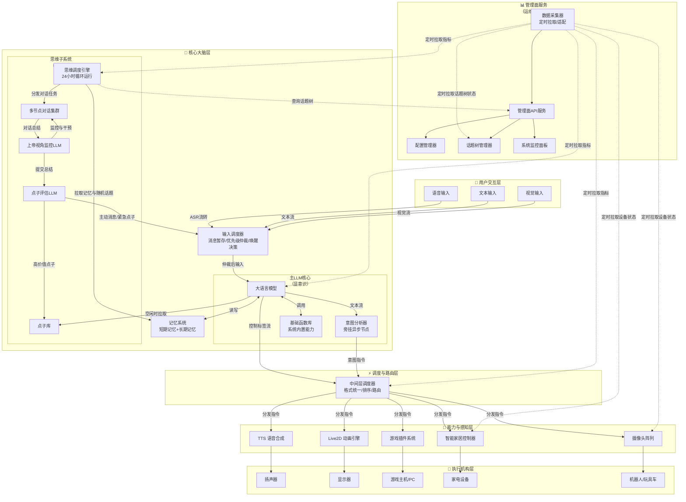
```mermaid
graph TB
    subgraph 用户交互层["👤 用户交互层"]
        Voice[语音输入]
        Text[文本输入]
        Visual[视觉输入]
    end

    subgraph 核心大脑层["🧠 核心大脑层"]
        subgraph 主LLM核心["主LLM核心<br/>（显意识）"]
            LLM[大语言模型]
            IntentAnalyzer[意图分析器<br/>旁挂异步节点]
            NativeFunctions[基础函数库<br/>系统内置能力]
        end
        subgraph 思维子系统["思维子系统<br/>（潜意识/后台思考引擎）"]
            ThinkEngine[思维调度引擎<br/>24小时循环运行]
            ThinkNodes[多节点对话集群]
            GodLLM[上帝视角监控LLM]
            EvalLLM[点子评估LLM]
            IdeaDB[点子库]
        end
        InputScheduler[输入调度器<br/>消息暂存/优先级仲裁/唤醒决策]
        MemSys[记忆系统<br/>短期记忆+长期记忆]
    end

    subgraph 调度与路由层["⚡ 调度与路由层"]
        MidScheduler[中间层调度器<br/>格式统一/排序/路由]
    end

    subgraph 能力与感知层["🔧 能力与感知层"]
        TTS[TTS 语音合成]
        L2D[Live2D 动画引擎]
        GamePlugin[游戏插件系统]
        SmartHome[智能家居控制器]
        Camera[摄像头阵列]
    end

    subgraph 执行机构层["🎯 执行机构层"]
        Speaker[扬声器]
        Display[显示器]
        GameConsole[游戏主机/PC]
        HomeDevices[家电设备]
        Robot[机器人/玩具车]
    end

    subgraph 管理面服务["📊 管理面服务<br/>（运维管理平面）"]
        MgmtAPI[管理面API服务]
        DataCollector[数据采集器<br/>定时拉取/适配]
        ConfigManager[配置管理器]
        TopicTreeManager[话题树管理器]
        Dashboard[系统监控面板]
    end

    Voice -->|ASR流转| InputScheduler
    Text -->|文本流| InputScheduler
    Visual -->|视觉流| InputScheduler
    InputScheduler -->|仲裁后输入| LLM

    LLM <-->|读写| MemSys
    LLM -->|文本流| IntentAnalyzer
    LLM -->|控制标签流| MidScheduler
    LLM <-->|调用| NativeFunctions
    IntentAnalyzer -->|意图指令| MidScheduler

    ThinkEngine -->|拉取记忆与随机话题| MemSys
    ThinkEngine -.->|查询话题树| MgmtAPI
    ThinkEngine -->|分发对话任务| ThinkNodes
    ThinkNodes -->|对话总结| GodLLM
    GodLLM -->|监控与干预| ThinkNodes
    GodLLM -->|提交总结| EvalLLM
    EvalLLM -->|高价值点子| IdeaDB
    EvalLLM -->|主动消息/紧急点子| InputScheduler
    LLM -->|空闲时拉取| IdeaDB

    MidScheduler -->|分发指令| TTS
    MidScheduler -->|分发指令| L2D
    MidScheduler -->|分发指令| GamePlugin
    MidScheduler -->|分发指令| SmartHome
    MidScheduler -->|分发指令| Camera
    TTS --> Speaker
    L2D --> Display
    GamePlugin --> GameConsole
    SmartHome --> HomeDevices
    Camera --> Robot

    DataCollector -.->|定时拉取指标| LLM
    DataCollector -.->|定时拉取指标| ThinkEngine
    DataCollector -.->|定时拉取指标| MidScheduler
    DataCollector -.->|定时拉取设备状态| SmartHome
    DataCollector -.->|定时拉取设备状态| Camera
    DataCollector -.->|定时拉取话题树状态| TopicTreeManager
    MgmtAPI --> Dashboard
    MgmtAPI --> ConfigManager
    MgmtAPI --> TopicTreeManager
    DataCollector --> MgmtAPI
```

### 1.4 双核架构：显意识与潜意识

聆雪的核心大脑层采用了独特的**双核架构**，类比人类的认知模型：

| 核心 | 类比 | 运行模式 | 主要职责 |
|------|------|----------|----------|
| **主LLM核心** | 显意识 | 事件驱动，响应外部输入 | 即时交互、指令执行、多模态输出 |
| **思维子系统** | 潜意识/后台思考 | 24小时循环运行，自激振荡 | 信息整理、自由探索、点子生成、主动推送 |

这一设计赋予了聆雪超越传统被动响应式AI的**主动性**——她能够在没有外部输入的情况下，自主地思考、学习、产生灵感，并在合适的时机主动发起对话或执行动作。

---

## 第二章：核心大脑层详细架构

### 2.1 主LLM核心

主LLM核心是聆雪的“显意识”所在，负责处理所有即时交互任务。其核心设计理念是：**单一大脑，结构化输出，旁挂增强**。

#### 2.1.1 结构化输出机制

主LLM在一次推理中同时输出：
- **对话文本**：直接送往TTS进行语音合成
- **控制标签**：结构化的JSON指令，用于控制L2D表情、游戏操作、设备控制等

这种设计从源头保证了“言行一致”——当她用文字表达“开心”时，对应的控制标签会同步驱动L2D引擎展示“开心”的表情，无需外部对齐。

#### 2.1.2 意图分析器（旁挂异步节点）

意图分析器是主LLM核心的旁挂模块。它异步接收主LLM输出的文本副本，从中解析意图，并将解析结果以指令形式注入控制标签流。其核心价值在于：

- **确定性兜底**：LLM可能因概率特性而未输出显式控制标签，意图分析器确保系统仍能从文本中提取意图并转化为控制指令
- **不阻塞主流程**：旁挂异步运行，意图分析的延迟不影响对话文本的流式输出
- **可接受降级**：当意图分析器无法可靠解析意图时，系统接受该边界情况，依赖用户主动重复指令进行修正

#### 2.1.3 总结会话（外部触发）

总结任务不由主LLM自觉执行，而是由外部定时器或对话轮次计数器强制触发。触发后，系统创建独立的总结会话（隔离上下文），将最近的对话历史打包并注入总结指令，获取结果后存入长期记忆。主会话对此过程无感知，仅在下一轮对话时被注入“上次对话核心结论”的摘要。

#### 2.1.4 核心大脑层内部结构

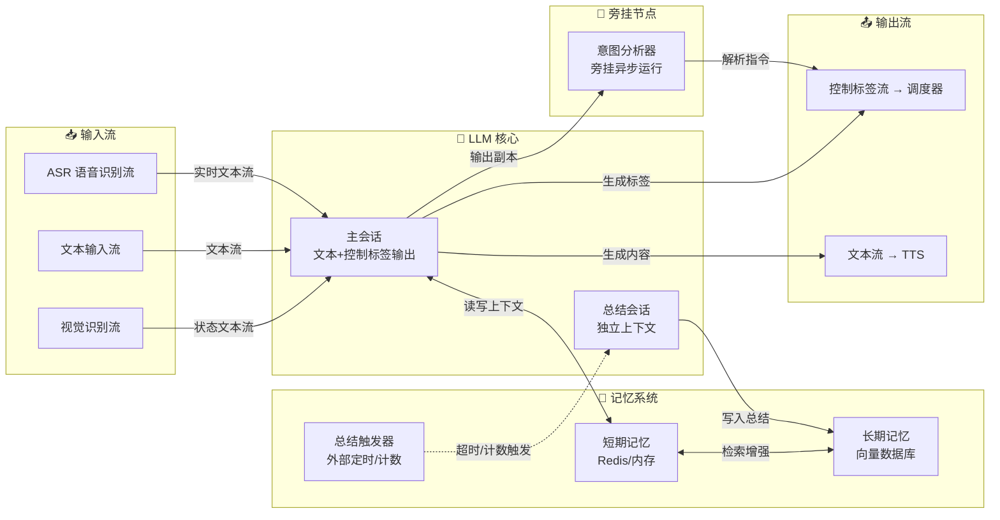
```mermaid
graph LR
    subgraph 输入流["📥 输入流"]
        ASR[ASR 语音识别流]
        TextStream[文本输入流]
        VisualStream[视觉识别流]
    end

    subgraph 记忆系统["💾 记忆系统"]
        STM[短期记忆<br/>Redis/内存]
        LTM[长期记忆<br/>向量数据库]
        SummaryTrigger[总结触发器<br/>外部定时/计数]
    end

    subgraph LLM核心["🧠 LLM 核心"]
        MainSession[主会话<br/>文本+控制标签输出]
        SummarySession[总结会话<br/>独立上下文]
    end

    subgraph 输出流["📤 输出流"]
        TextOut[文本流 → TTS]
        TagOut[控制标签流 → 调度器]
    end

    subgraph 旁挂节点["🔗 旁挂节点"]
        IntentAnalyzer[意图分析器<br/>旁挂异步运行]
    end

    ASR -->|实时文本流| MainSession
    TextStream -->|文本流| MainSession
    VisualStream -->|状态文本流| MainSession

    MainSession <-->|读写上下文| STM
    MainSession -->|生成内容| TextOut
    MainSession -->|生成标签| TagOut
    MainSession -->|输出副本| IntentAnalyzer

    SummaryTrigger -.->|超时/计数触发| SummarySession
    SummarySession -->|写入总结| LTM
    STM <-->|检索增强| LTM

    IntentAnalyzer -->|解析指令| TagOut
```

---

### 2.2 基础Function Calling能力体系

#### 2.2.1 设计理念

聆雪作为一个智能体，除了通过即插即用机制接入的物理设备外，还需要一系列**不依赖于物理硬件的基础能力**。这些能力在系统启动时自动注册，遵循“万物皆插件”的原则——即使是最核心的内置能力，也以插件形式注册到管理面服务，支持运行时动态启用/禁用。

#### 2.2.2 能力注册机制

所有能力（无论是系统内置的基础函数，还是外部设备接入的能力）均遵循统一的注册协议。系统启动时，内置能力通过**能力注册中心**自动注册；运行时，可通过管理面服务的API动态注册新的能力服务（使用MCP兼容协议）。管理面服务维护全局能力清单，并提供启用/禁用开关。

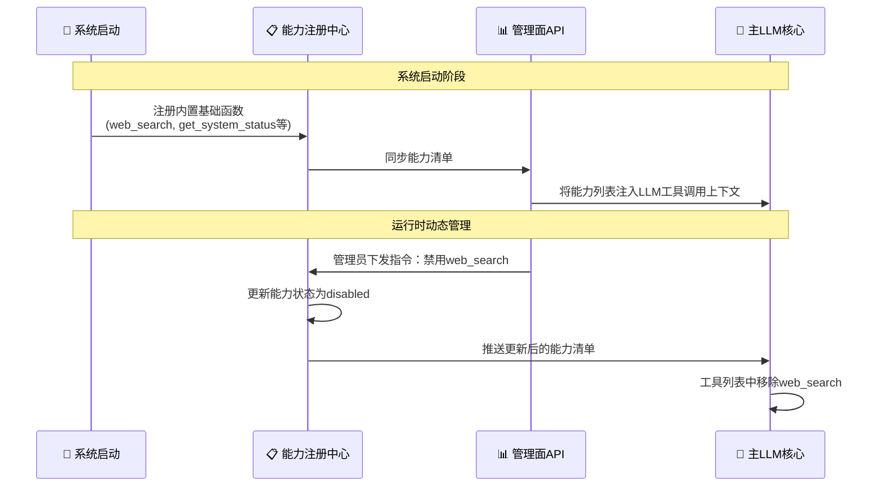
```mermaid
sequenceDiagram
    participant Boot as 🚀 系统启动
    participant RegCenter as 📋 能力注册中心
    participant MgmtAPI as 📊 管理面API
    participant LLM as 🧠 主LLM核心

    Note over Boot,LLM: 系统启动阶段
    Boot->>RegCenter: 注册内置基础函数<br/>(web_search, get_system_status等)
    RegCenter->>MgmtAPI: 同步能力清单
    MgmtAPI->>LLM: 将能力列表注入LLM工具调用上下文

    Note over Boot,LLM: 运行时动态管理
    MgmtAPI->>RegCenter: 管理员下发指令：禁用web_search
    RegCenter->>RegCenter: 更新能力状态为disabled
    RegCenter->>LLM: 推送更新后的能力清单
    LLM->>LLM: 工具列表中移除web_search
```

#### 2.2.3 基础函数分类

##### 信息获取类

| 函数名 | 功能描述 | 参数 | 返回值 |
|--------|----------|------|--------|
| `web_search` | 互联网搜索 | `query: string` | 结构化搜索结果列表 |
| `get_current_time` | 获取当前时间与时区 | `timezone?: string` | ISO8601时间戳与格式化时间字符串 |
| `get_geolocation` | 获取当前设备地理位置 | 无 | 经纬度、地址描述 |
| `get_weather` | 获取指定位置的天气信息 | `location: string` | 天气状况、温度、湿度、未来预报 |

##### 系统自省类

| 函数名 | 功能描述 | 参数 | 返回值 |
|--------|----------|------|--------|
| `get_system_status` | 读取各子系统运行指标 | `subsystem?: string` | CPU/GPU占用、内存、温度等 |
| `get_active_sessions` | 查询当前活跃会话数与会话池使用率 | 无 | 活跃会话数、会话池容量、使用百分比 |
| `get_device_inventory` | 查询当前在线设备清单 | 无 | 设备ID、类型、在线状态列表 |
| `get_idea_queue_length` | 查询点子库中待处理点子数量 | 无 | 待处理点子数、最旧点子时间戳 |

##### 主动通信类

| 函数名 | 功能描述 | 参数 | 返回值 |
|--------|----------|------|--------|
| `proactive_speak` | 通过TTS主动发起语音对话 | `message: string, urgency: int` | 执行状态 |
| `proactive_notify` | 通过移动端推送通知 | `title: string, body: string, urgency: int` | 执行状态 |

#### 2.2.4 能力开关的应用场景

“万物皆插件、皆可开关”的设计为多样化的交互场景提供了灵活性：

| 场景 | 操作 | 效果 |
|------|------|------|
| 趣味知识竞赛 | 管理面禁用`web_search` | 聆雪只能依靠自身知识回答，无法联网作弊 |
| 隐私模式 | 管理面禁用`get_geolocation` | 位置信息不可获取 |
| 深度思考模式 | 管理面禁用`proactive_speak` | 暂停主动打扰，专注后台思考 |
| 性能保护 | 健康巡检自动禁用高耗能能力 | GPU温度过高时临时关闭某些非必要能力 |

---

### 2.3 思维子系统（潜意识/后台思考引擎）

思维子系统是聆雪“主动性”的灵魂。其设计哲学源于“日有所思，夜有所梦”的认知模型：将日间积累的新知识与随机话题混合，通过多节点对话进行自由探索，从中提炼有价值的“点子”，并在合适时机主动推送给主LLM核心。

#### 2.3.1 设计目标

- **信息整理**：对日间获取的新知识进行归纳、关联与深度加工
- **自由探索**：通过随机话题组合，驱动跨领域的创造性联想
- **点子生成**：从发散性对话中收敛出有执行价值或沟通价值的灵感
- **主动推送**：在恰当的条件下，主动向主LLM核心发送消息，驱动主动行为

#### 2.3.2 工作流程总览

思维子系统的工作流程分为四个标准化阶段，由思维调度引擎统一编排。阶段一负责从记忆系统、管理面话题树、外部API等多源拉取素材并组装为素材包；阶段二将素材包分发至多个隔离上下文的LLM节点进行自由对话推演，期间由上帝视角LLM持续监控话题健康度并在必要时干预；阶段三由评估LLM对各节点提交的对话总结进行多维度评分，筛选出高价值点子；阶段四根据点子的紧急程度决定通信路径——紧急点子通过输入调度器直接推送至主LLM核心，普通点子写入点子库等待空闲拉取。

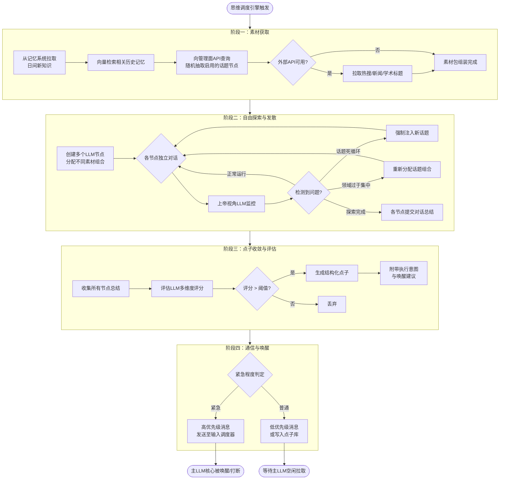
```mermaid
graph TB
    Start([思维调度引擎触发]) --> Phase1

    subgraph Phase1["阶段一：素材获取"]
        A1[从记忆系统拉取<br/>日间新知识] --> A2[向量检索相关历史记忆]
        A2 --> A3[向管理面API查询<br/>随机抽取启用的话题节点]
        A3 --> A4{外部API可用?}
        A4 --是--> A5[拉取热搜/新闻/学术标题]
        A4 --否--> A6[素材包组装完成]
        A5 --> A6
    end

    Phase1 --> Phase2

    subgraph Phase2["阶段二：自由探索与发散"]
        B1[创建多个LLM节点<br/>分配不同素材组合] --> B2{各节点独立对话}
        B2 --> B3[上帝视角LLM监控]
        B3 --> B4{检测到问题?}
        B4 --话题死循环--> B5[强制注入新话题]
        B4 --领域过于集中--> B6[重新分配话题组合]
        B4 --正常运行--> B2
        B5 --> B2
        B6 --> B2
        B4 --探索完成--> B7[各节点提交对话总结]
    end

    Phase2 --> Phase3

    subgraph Phase3["阶段三：点子收敛与评估"]
        C1[收集所有节点总结] --> C2[评估LLM多维度评分]
        C2 --> C3{评分 > 阈值?}
        C3 --是--> C4[生成结构化点子]
        C3 --否--> C5[丢弃]
        C4 --> C6[附带执行意图<br/>与唤醒建议]
    end

    Phase3 --> Phase4

    subgraph Phase4["阶段四：通信与唤醒"]
        D1{紧急程度判定}
        D1 --紧急--> D2[高优先级消息<br/>发送至输入调度器]
        D1 --普通--> D3[低优先级消息<br/>或写入点子库]
    end

    D2 --> End([主LLM核心被唤醒/打断])
    D3 --> End2([等待主LLM空闲拉取])
```

#### 2.3.3 阶段一：素材获取时序

素材获取是思维子系统的输入环节，决定了本轮“梦境”的探索方向。引擎首先从短期记忆拉取自上一思维周期以来新增的记忆条目，随后以这些条目为锚点在长期记忆中进行向量相似检索，补充历史相关信息。话题素材不再依赖静态配置文件，而是通过管理面API实时查询启用的话题节点，管理面根据配置的权重随机抽取并返回。若外部API可用（如联网热搜、学术预印本标题），引擎还可拉取外部刺激以增强素材的时效性和多样性。所有素材最终组装为统一的素材包，等待分发至对话节点。

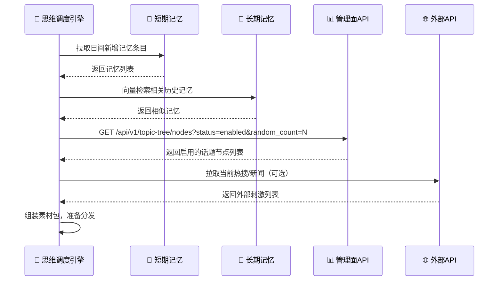
```mermaid
sequenceDiagram
    participant Engine as 🧠 思维调度引擎
    participant STM as 💾 短期记忆
    participant LTM as 💾 长期记忆
    participant MgmtAPI as 📊 管理面API
    participant API as 🌐 外部API

    Engine->>STM: 拉取日间新增记忆条目
    STM-->>Engine: 返回记忆列表
    Engine->>LTM: 向量检索相关历史记忆
    LTM-->>Engine: 返回相似记忆
    Engine->>MgmtAPI: GET /api/v1/topic-tree/nodes?status=enabled&random_count=N
    MgmtAPI-->>Engine: 返回启用的话题节点列表
    Engine->>API: 拉取当前热搜/新闻（可选）
    API-->>Engine: 返回外部刺激列表
    Engine->>Engine: 组装素材包，准备分发
```

#### 2.3.4 阶段二：多节点并行对话与上帝视角监控

阶段二是思维子系统的核心推演环节。调度引擎根据素材包数量创建对应数量的LLM节点，每个节点拥有独立的对话上下文，被注入不同的素材组合（通过随机抽取话题并合并或分发实现）。各节点在隔离环境中并行进行自由对话推演。

上帝视角LLM作为监控节点，拥有纵观所有对话节点的权限。每个节点定期向它上报对话摘要，上帝视角LLM负责分析整体话题分布，检测是否存在话题死循环（某节点连续多轮未切换话题）或领域过度集中（所有节点的话题聚集在少数领域）等问题。一旦检测到异常，上帝视角LLM通过强制注入新话题或重新分配话题组合的方式进行干预。当所有节点完成预设的推演轮次后，各自提交对话总结，进入阶段三。

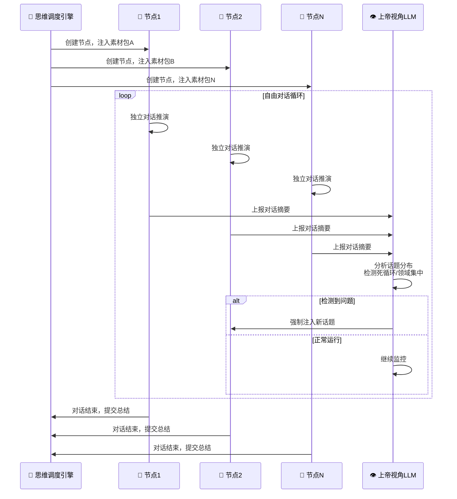
```mermaid
sequenceDiagram
    participant Engine as 🧠 思维调度引擎
    participant Node1 as 💬 节点1
    participant Node2 as 💬 节点2
    participant NodeN as 💬 节点N
    participant God as 👁️ 上帝视角LLM

    Engine->>Node1: 创建节点，注入素材包A
    Engine->>Node2: 创建节点，注入素材包B
    Engine->>NodeN: 创建节点，注入素材包N

    loop 自由对话循环
        Node1->>Node1: 独立对话推演
        Node2->>Node2: 独立对话推演
        NodeN->>NodeN: 独立对话推演

        Node1->>God: 上报对话摘要
        Node2->>God: 上报对话摘要
        NodeN->>God: 上报对话摘要

        God->>God: 分析话题分布<br/>检测死循环/领域集中

        alt 检测到问题
            God->>Node2: 强制注入新话题
        else 正常运行
            God->>God: 继续监控
        end
    end

    Node1->>Engine: 对话结束，提交总结
    Node2->>Engine: 对话结束，提交总结
    NodeN->>Engine: 对话结束，提交总结
```

#### 2.3.5 阶段三：点子评估流程

阶段三负责从发散性对话中收敛出有价值的“点子”。评估LLM对每个节点提交的对话总结进行四维度评分：重要性（是否具有执行价值或决策参考意义）、趣味性（是否适合作为主动聊天话题）、可行性（是否在当前系统能力范围内）、时效性（是否需要立即处理）。四个维度的加权综合评分决定该总结是被转化为结构化点子还是直接丢弃。

通过阈值筛选的点子被封装为包含标题、摘要、评分详情、建议执行意图和唤醒建议的结构化数据。根据综合评分中的时效性维度，点子被进一步标记为“紧急”或“普通”，进入阶段四的差异化通信路径。

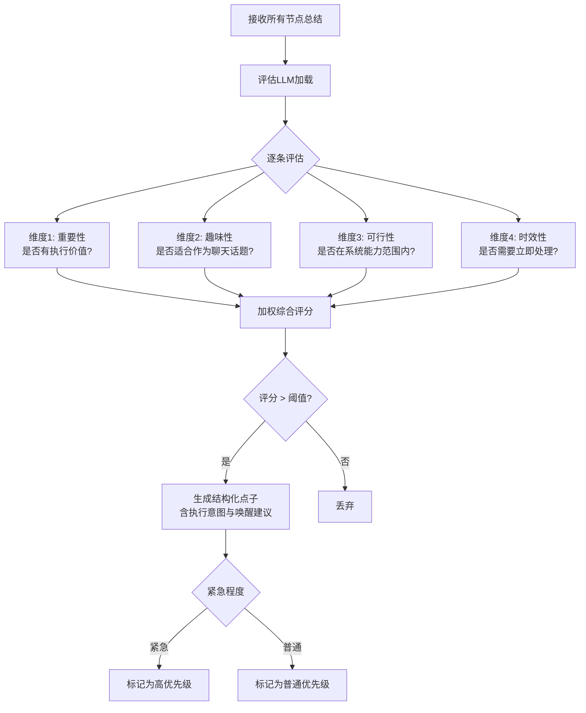
```mermaid
graph TB
    A[接收所有节点总结] --> B[评估LLM加载]
    B --> C{逐条评估}

    C --> D1[维度1: 重要性<br/>是否有执行价值?]
    C --> D2[维度2: 趣味性<br/>是否适合作为聊天话题?]
    C --> D3[维度3: 可行性<br/>是否在系统能力范围内?]
    C --> D4[维度4: 时效性<br/>是否需要立即处理?]

    D1 --> E[加权综合评分]
    D2 --> E
    D3 --> E
    D4 --> E

    E --> F{评分 > 阈值?}
    F --是--> G[生成结构化点子<br/>含执行意图与唤醒建议]
    F --否--> H[丢弃]

    G --> I{紧急程度}
    I --紧急--> J[标记为高优先级]
    I --普通--> K[标记为普通优先级]
```

#### 2.3.6 阶段四：通信与唤醒时序

阶段四负责将评估后的点子送达主LLM核心，其通信路径根据紧急程度差异化处理。紧急点子通过思维子系统API以高优先级消息的形式直接发送至输入调度器。输入调度器根据主LLM核心的当前状态决定立即推送还是暂存队列；若在队列中等待超时（默认5分钟），消息自动降级写入点子库并标记“待处理”，模拟人类“灵光乍现但稍纵即逝”的认知过程。

普通点子不经过输入调度器，直接写入点子库。主LLM核心在空闲时主动拉取点子库中的待处理条目，根据人设性格和当前场景决定是否发起主动对话或执行建议的动作。这一差异化设计确保了紧急灵感能够即时传递，同时避免了普通点子对正在进行的用户交互造成不必要的打断。

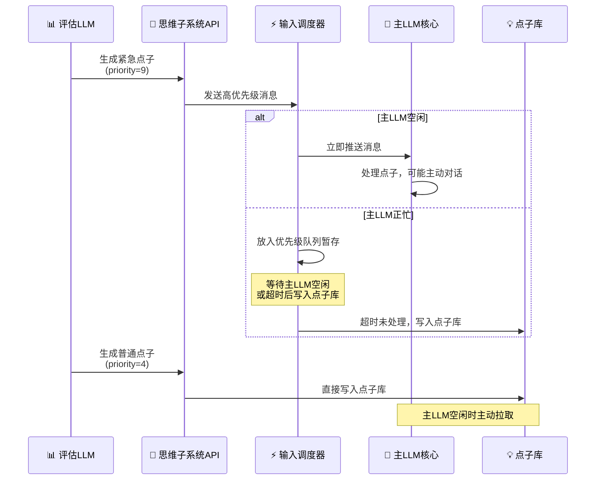
```mermaid
sequenceDiagram
    participant Eval as 📊 评估LLM
    participant ThinkAPI as 🔌 思维子系统API
    participant InputSch as ⚡ 输入调度器
    participant LLM as 🧠 主LLM核心
    participant IdeaDB as 💡 点子库

    Eval->>ThinkAPI: 生成紧急点子<br/>(priority=9)
    ThinkAPI->>InputSch: 发送高优先级消息

    alt 主LLM空闲
        InputSch->>LLM: 立即推送消息
        LLM->>LLM: 处理点子，可能主动对话
    else 主LLM正忙
        InputSch->>InputSch: 放入优先级队列暂存
        Note over InputSch: 等待主LLM空闲<br/>或超时后写入点子库
        InputSch->>IdeaDB: 超时未处理，写入点子库
    end

    Eval->>ThinkAPI: 生成普通点子<br/>(priority=4)
    ThinkAPI->>IdeaDB: 直接写入点子库
    Note over LLM,IdeaDB: 主LLM空闲时主动拉取
```

#### 2.3.7 话题树系统

思维子系统的话题树由**管理面服务动态管理**，而非静态配置文件。话题树的多级分类结构、各节点的启用状态、领域权重等均存储在管理面数据库中。思维调度引擎在每轮周期的阶段一中，通过管理面API实时查询启用的话题节点。管理面提供话题树的可视化编辑界面，支持运行时增删节点、批量启用/禁用、调整领域权重，变更即时生效，下一轮思维周期自动应用新配置。

**随机组合策略**：

| 策略名称 | 操作方式 | 目的 |
|----------|----------|------|
| **多话题合并** | 随机抽取多个话题节点，合并为同一提示词，注入同一对话节点 | 强制跨领域关联，催生创造性联想 |
| **多话题分发** | 随机抽取不同话题，分别注入不同对话节点 | 增加思维广度，多方向并行探索 |
| **加权抽取** | 根据近期对话中涉及的话题频率，反向加权抽取 | 防止思维固化，鼓励探索新领域 |

话题树覆盖的一级领域包括：自然科学、人文历史与社会科学、艺术与创作、技术与工程、生活实用、休闲与娱乐、情感心理与性、猎奇玄学与脑洞、职场与学业、时事与公共议题等，每个一级领域下细分至三级子类，总节点数逾千。

#### 2.3.8 输入调度器

输入调度器是连接思维子系统（潜意识）与主LLM核心（显意识）的关键组件，其职责如下：

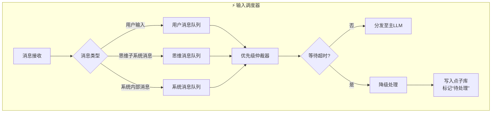
```mermaid
graph TB
    subgraph 输入调度器["⚡ 输入调度器"]
        Recv[消息接收] --> Classify{消息类型}

        Classify --用户输入--> UserQueue[用户消息队列]
        Classify --思维子系统消息--> ThinkQueue[思维消息队列]
        Classify --系统内部消息--> SysQueue[系统消息队列]

        UserQueue --> Arbiter[优先级仲裁器]
        ThinkQueue --> Arbiter
        SysQueue --> Arbiter

        Arbiter --> Timeout{等待超时?}
        Timeout --否--> Dispatch[分发至主LLM]
        Timeout --是--> Fallback[降级处理]

        Fallback --> IdeaDB[写入点子库<br/>标记“待处理”]
    end
```

**核心功能**：

1. **消息暂存**：当主LLM正忙时，来自思维子系统的消息放入优先级队列暂存
2. **超时记录**：消息在队列中等待超时（默认5分钟）后，自动写入点子库，标记为“待处理”
3. **唤醒决策**：主LLM空闲时，从队列和点子库中拉取消息，根据优先级和时效性决定是否立即发起主动对话
4. **强制唤醒**：对于标记为“紧急”的消息，无论主LLM当前状态如何，强制中断当前任务并推送

#### 2.3.9 “睡眠”与“唤醒”功能

基于双核架构，“睡眠”与“唤醒”功能的实现极为自然：

**入睡流程**：
1. 用户发出“睡觉”指令，或触发预设的入睡条件
2. 主LLM核心进入静默模式，切断所有对外主动输出，但保持内部接口畅通
3. L2D引擎切换到预设的“睡眠”动画状态
4. 思维子系统照常运行，非紧急点子全部自动写入点子库

**唤醒条件**：

| 唤醒类型 | 触发条件 | 优先级 |
|----------|----------|--------|
| 内部紧急唤醒 | 思维子系统生成紧急级别点子 | 高 |
| 时间唤醒 | 到达用户预设的起床时间 | 中 |
| 环境唤醒 | 传感器检测到异常（烟雾、门窗异常开启等） | 高 |
| 用户唤醒 | 用户主动语音指令“聆雪，起床了” | 最高 |
| 外部事件唤醒 | 预设的智能家居事件或日程提醒 | 中 |

**醒后行为**：
主LLM核心被唤醒后，首先拉取点子库和消息队列中的待处理消息，根据人设性格，可能主动向用户问候并分享夜间产生的灵感。

---

## 第三章：调度与路由层详细架构

### 3.1 设计哲学

调度层是聆雪的“神经系统”。它采用**分层末端自治**的架构，每个执行单元自带调度器，中间层仅做汇总和透传。核心优势包括：

- **降低中心复杂度**：中间调度器不做意图理解，只做格式化和路由
- **提升扩展性**：新增设备仅需新增对应的末端调度器，无需修改核心代码
- **故障隔离**：某个末端调度器故障不影响其他模块正常运行
- **物理部署灵活性**：末端调度器可部署在嵌入式设备上，与核心节点通过网络通信

### 3.2 中间层调度器

中间层调度器的职责极为精简：

1. **格式适配**：将来自不同来源的控制指令统一转换为标准指令格式
2. **优先级排序**：按指令携带的优先级字段进行排序
3. **路由分发**：根据指令的`target`字段，将指令路由至对应的末端调度器

### 3.3 末端调度器

每个执行机构配备专属的末端调度器，其标准工作流为：

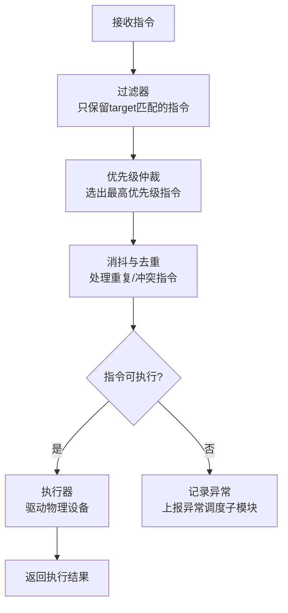
```mermaid
graph TB
    A[接收指令] --> B[过滤器<br/>只保留target匹配的指令]
    B --> C[优先级仲裁<br/>选出最高优先级指令]
    C --> D[消抖与去重<br/>处理重复/冲突指令]
    D --> E{指令可执行?}
    E --是--> F[执行器<br/>驱动物理设备]
    E --否--> G[记录异常<br/>上报异常调度子模块]
    F --> H[返回执行结果]
```

### 3.4 分层调度架构

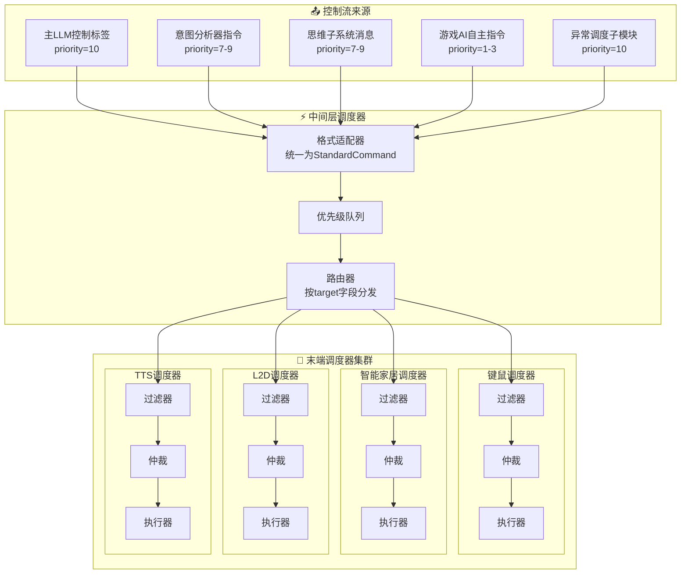
```mermaid
graph TB
    subgraph 控制流来源["📤 控制流来源"]
        LLMTags[主LLM控制标签<br/>priority=10]
        IntentCmd[意图分析器指令<br/>priority=7-9]
        ThinkCmd[思维子系统消息<br/>priority=7-9]
        GameAI[游戏AI自主指令<br/>priority=1-3]
        ErrorCmd[异常调度子模块<br/>priority=10]
    end

    subgraph 中间层调度器["⚡ 中间层调度器"]
        FormatAdapter[格式适配器<br/>统一为StandardCommand]
        PriorityQueue[优先级队列]
        Router[路由器<br/>按target字段分发]
    end

    subgraph 末端调度器集群["🎯 末端调度器集群"]
        subgraph 键鼠调度器["键鼠调度器"]
            KM_Filter[过滤器] --> KM_Priority[仲裁] --> KM_Exec[执行器]
        end
        subgraph 智能家居调度器["智能家居调度器"]
            SH_Filter[过滤器] --> SH_Priority[仲裁] --> SH_Exec[执行器]
        end
        subgraph L2D调度器["L2D调度器"]
            L2D_Filter[过滤器] --> L2D_Priority[仲裁] --> L2D_Exec[执行器]
        end
        subgraph TTS调度器["TTS调度器"]
            TTS_Filter[过滤器] --> TTS_Priority[仲裁] --> TTS_Exec[执行器]
        end
    end

    LLMTags --> FormatAdapter
    IntentCmd --> FormatAdapter
    ThinkCmd --> FormatAdapter
    GameAI --> FormatAdapter
    ErrorCmd --> FormatAdapter

    FormatAdapter --> PriorityQueue
    PriorityQueue --> Router

    Router --> KM_Filter
    Router --> SH_Filter
    Router --> L2D_Filter
    Router --> TTS_Filter
```

### 3.5 统一指令格式

所有在调度层流动的指令，均需符合以下标准格式：

```json
{
  "source": "llm_tag | intent_analyzer | game_ai | think_subsystem | error_handler",
  "target": "keyboard | smart_home | projector | tts | l2d | camera | ...",
  "action": "string",
  "params": {},
  "priority": 1-10,
  "timestamp": "ISO8601",
  "trace_id": "uuid"
}
```

### 3.6 优先级体系

| 优先级 | 来源 | 说明 |
|--------|------|------|
| **最高（10）** | 主LLM核心控制标签、异常调度子模块 | 言语即命令；异常反应必须即时可见 |
| **高（7-9）** | 意图分析器指令、思维子系统紧急消息 | 旁挂解析或潜意识生成的指令 |
| **中（4-6）** | 游戏会话、动作会话自主输出 | 专项会话的常规输出 |
| **低（1-3）** | 游戏AI自主指令 | 底层自主运行，可被上层覆盖 |
| **可覆盖（0）** | 默认兜底逻辑 | 超时无指令时的默认行为 |

---

## 第四章：异常处理与健康巡检子系统

### 4.1 设计目标

复杂分布式系统的核心风险在于：任一子模块的故障都可能导致不可预测的级联行为。异常处理与健康巡检子系统是聆雪的“免疫系统”，负责：

- **统一异常收集**：各子模块仅需上报异常，不负责处理异常
- **分级响应**：根据异常严重程度，触发不同级别的拟人化表现或通知
- **主动巡检**：定期扫描各子系统健康状态，在异常发生前预警
- **日志持久化**：所有异常记录统一存储，支持事后排查

### 4.2 子系统架构

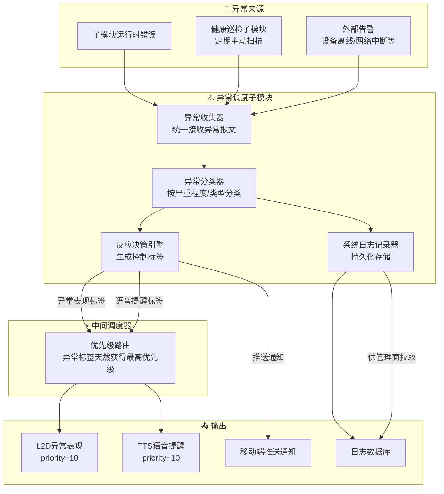
```mermaid
graph TB
    subgraph 异常来源["🚨 异常来源"]
        SubmoduleError[子模块运行时错误]
        HealthCheck[健康巡检子模块<br/>定期主动扫描]
        ExternalAlert[外部告警<br/>设备离线/网络中断等]
    end

    subgraph 异常调度子模块["⚠️ 异常调度子模块"]
        ErrorCollector[异常收集器<br/>统一接收异常报文]
        ErrorClassifier[异常分类器<br/>按严重程度/类型分类]
        ErrorLogger[系统日志记录器<br/>持久化存储]
        ReactionEngine[反应决策引擎<br/>生成控制标签]
    end

    subgraph 输出["📤 输出"]
        L2D_Error[L2D异常表现<br/>priority=10]
        TTS_Error[TTS语音提醒<br/>priority=10]
        Notify[移动端推送通知]
        LogDB[日志数据库]
    end

    subgraph 中间调度器["⚡ 中间调度器"]
        PriorityRoute[优先级路由<br/>异常标签天然获得最高优先级]
    end

    SubmoduleError --> ErrorCollector
    HealthCheck --> ErrorCollector
    ExternalAlert --> ErrorCollector

    ErrorCollector --> ErrorClassifier
    ErrorClassifier --> ErrorLogger
    ErrorClassifier --> ReactionEngine

    ErrorLogger --> LogDB
    ErrorLogger -->|供管理面拉取| LogDB

    ReactionEngine -->|异常表现标签| PriorityRoute
    ReactionEngine -->|语音提醒标签| PriorityRoute
    ReactionEngine -->|推送通知| Notify

    PriorityRoute --> L2D_Error
    PriorityRoute --> TTS_Error
```

### 4.3 异常分级与对应表现

| 级别 | 触发条件示例 | L2D表现 | 语音/通知 | 用户感知 |
|------|------------|---------|-----------|----------|
| **轻微** | GPU占用>90%、单模块响应延迟>3s | “脸红”/“发热”表情 | 主动语音：“我有点热” | 拟人化轻微不适 |
| **中等** | 某模块连续3次报错、设备离线 | “印堂发黑”/“皱眉” | 语音告知具体问题 | 明确的问题提示 |
| **严重** | 核心模块崩溃、LLM推理连续失败 | “晕厥”/“故障”动画 | 推送通知用户，尝试自动恢复 | 立即通知，需关注 |
| **致命** | 系统无法自恢复 | 最小核心存活模式 | 全渠道通知 | 需立即人工干预 |

### 4.4 健康巡检子模块工作流程

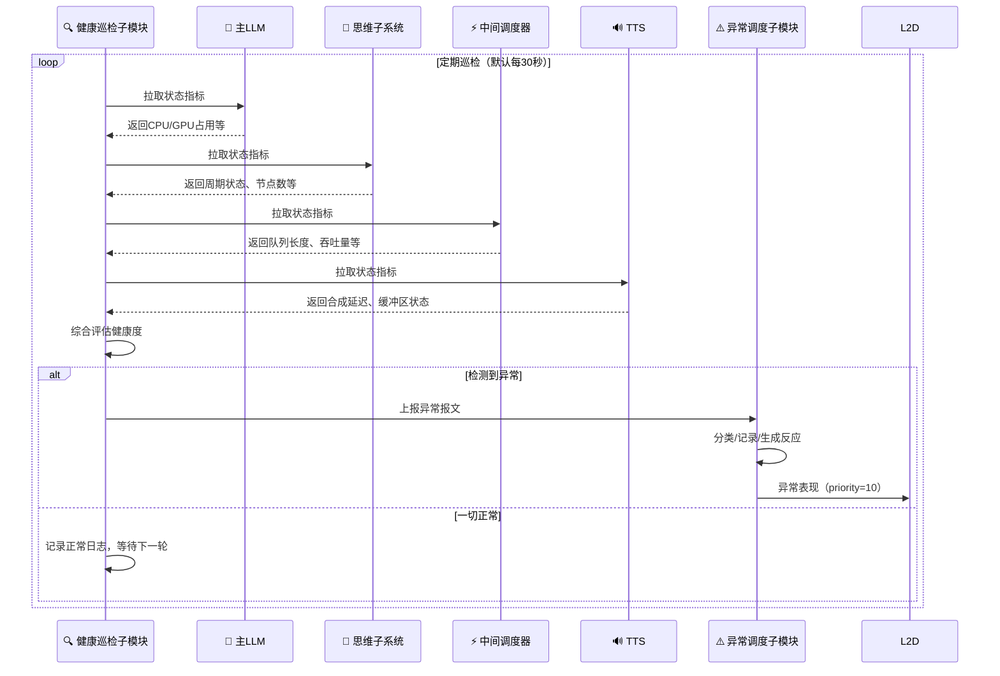
```mermaid
sequenceDiagram
    participant HC as 🔍 健康巡检子模块
    participant LLM as 🧠 主LLM
    participant Think as 🧠 思维子系统
    participant Scheduler as ⚡ 中间调度器
    participant TTS as 🔊 TTS
    participant Error as ⚠️ 异常调度子模块

    loop 定期巡检（默认每30秒）
        HC->>LLM: 拉取状态指标
        LLM-->>HC: 返回CPU/GPU占用等

        HC->>Think: 拉取状态指标
        Think-->>HC: 返回周期状态、节点数等

        HC->>Scheduler: 拉取状态指标
        Scheduler-->>HC: 返回队列长度、吞吐量等

        HC->>TTS: 拉取状态指标
        TTS-->>HC: 返回合成延迟、缓冲区状态

        HC->>HC: 综合评估健康度

        alt 检测到异常
            HC->>Error: 上报异常报文
            Error->>Error: 分类/记录/生成反应
            Error->>L2D: 异常表现（priority=10）
        else 一切正常
            HC->>HC: 记录正常日志，等待下一轮
        end
    end
```

---

## 第五章：管理面服务

### 5.1 设计定位

管理面服务是聆雪的**运维管理平面**（Management Plane），与控制流、数据流严格分离。它不介入实时交互链路，仅通过**定时采集**的方式拉取各子模块的状态数据，确保管理操作不会对聆雪的正常运行造成任何性能影响。

### 5.2 设计原则

- **单向采集，避免耦合**：管理面服务下属的数据采集器主动拉取各子模块暴露的指标接口，子模块无需主动上报，无需感知管理面的存在
- **万物皆注册，皆可开关**：所有能力（物理设备、内置函数、动态加载的MCP插件）均在管理面统一注册，支持运行时启用/禁用
- **配置集中管理**：系统核心参数通过管理面统一下发，子模块仅需暴露配置更新接口
- **话题树动态可配**：思维子系统的话题树结构、节点启用状态、领域权重均通过管理面实时管理，无需重启

### 5.3 管理面服务架构

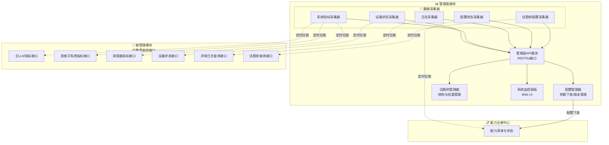
```mermaid
graph TB
    subgraph 管理面服务["📊 管理面服务"]
        MgmtAPI[管理面API服务<br/>RESTful接口]

        subgraph 数据采集器["📡 数据采集器"]
            DeviceCollector[设备状态采集器]
            MetricsCollector[系统指标采集器]
            LogCollector[日志采集器]
            ConfigCollector[配置状态采集器]
            TopicTreeCollector[话题树配置采集器]
        end

        ConfigManager[配置管理器<br/>参数下发/版本管理]
        TopicTreeManager[话题树管理器<br/>结构与权重管理]
        Dashboard[系统监控面板<br/>Web UI]
    end

    subgraph 被管理模块["🎯 被管理模块<br/>仅暴露查询接口"]
        LLM_Metrics[主LLM指标接口]
        Think_Metrics[思维子系统指标接口]
        Scheduler_Metrics[调度器指标接口]
        Device_Metrics[设备状态接口]
        Error_LogAPI[异常日志查询接口]
        TopicTreeAPI[话题树查询接口]
    end

    subgraph 能力注册中心["📋 能力注册中心"]
        CapRegistry[能力清单与状态]
    end

    DeviceCollector -.->|定时拉取| Device_Metrics
    MetricsCollector -.->|定时拉取| LLM_Metrics
    MetricsCollector -.->|定时拉取| Think_Metrics
    MetricsCollector -.->|定时拉取| Scheduler_Metrics
    LogCollector -.->|定时拉取| Error_LogAPI
    ConfigCollector -.->|定时拉取| CapRegistry
    TopicTreeCollector -.->|定时拉取| TopicTreeAPI

    DeviceCollector --> MgmtAPI
    MetricsCollector --> MgmtAPI
    LogCollector --> MgmtAPI
    ConfigCollector --> MgmtAPI
    TopicTreeCollector --> MgmtAPI

    ConfigManager -->|配置下发| CapRegistry
    MgmtAPI --> Dashboard
    MgmtAPI --> ConfigManager
    MgmtAPI --> TopicTreeManager
```

### 5.4 管理面核心功能

#### 5.4.1 话题树管理

- 可视化展示当前话题树的完整多级结构
- 支持增删话题节点、批量启用/禁用
- 支持调整各一级领域的抽取权重
- 展示近期各节点被抽取的频率统计
- 变更即时生效，无需重启思维子系统

#### 5.4.2 设备与能力清单视图

- 展示所有已注册的即插即用物理设备及其在线状态、能力描述符
- 展示所有已注册的Function Calling能力（含系统内置能力与动态加载的MCP插件）
- 支持对任意能力的**启用/禁用**操作，变更即时生效

#### 5.4.3 系统负荷与健康监控

- 实时CPU/GPU利用率、显存占用、内存使用、温度等核心指标仪表盘
- 当前活跃会话数、会话池使用率、点子库积压量、思维子系统周期状态
- 历史趋势图表，便于发现资源泄漏或性能退化

#### 5.4.4 异常与日志中心

- 汇聚异常调度子模块产生的所有异常记录，支持按级别、来源模块、时间筛选
- 系统运行日志的集中存储与检索接口
- 支持为特定级别的异常设置自动推送通知策略

#### 5.4.5 配置管理

- 系统核心参数的集中配置界面（会话池上限、思维周期频率、异常阈值等）
- 支持导出/导入配置文件，便于备份与迁移
- 配置变更记录版本历史，支持回滚

### 5.5 数据采集器工作流程

延续整个系统“单向控制”的设计思路，数据采集器采用**定时拉取**模式，各子模块仅需暴露标准化的数据查询接口，无需感知采集器的存在。

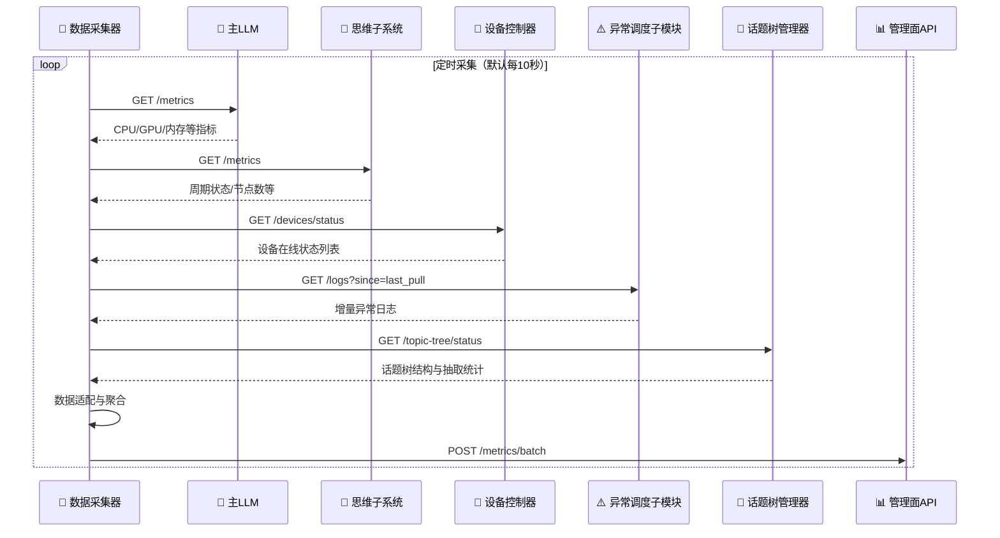
```mermaid
sequenceDiagram
    participant Collector as 📡 数据采集器
    participant LLM as 🧠 主LLM
    participant Think as 🧠 思维子系统
    participant Device as 🔧 设备控制器
    participant Error as ⚠️ 异常调度子模块
    participant TopicTree as 🌳 话题树管理器
    participant MgmtAPI as 📊 管理面API

    loop 定时采集（默认每10秒）
        Collector->>LLM: GET /metrics
        LLM-->>Collector: CPU/GPU/内存等指标

        Collector->>Think: GET /metrics
        Think-->>Collector: 周期状态/节点数等

        Collector->>Device: GET /devices/status
        Device-->>Collector: 设备在线状态列表

        Collector->>Error: GET /logs?since=last_pull
        Error-->>Collector: 增量异常日志

        Collector->>TopicTree: GET /topic-tree/status
        TopicTree-->>Collector: 话题树结构与抽取统计

        Collector->>Collector: 数据适配与聚合
        Collector->>MgmtAPI: POST /metrics/batch
    end
```

---

## 第六章：游戏插件系统详细架构

### 6.1 双模式自适应策略

| 游戏类型 | 特征 | 控制路径 | 典型游戏 |
|----------|------|----------|----------|
| **反射型游戏** | 需要毫秒级响应，高频操作 | 专用游戏AI自主运行 + LLM宏观决策 | OSU!、空洞骑士、赛博朋克2077 |
| **思考型游戏** | 不需要实时响应，可从容决策 | LLM通过Function Calling直接操作 | 猜词游戏、策略游戏、文字冒险 |

### 6.2 游戏插件系统架构

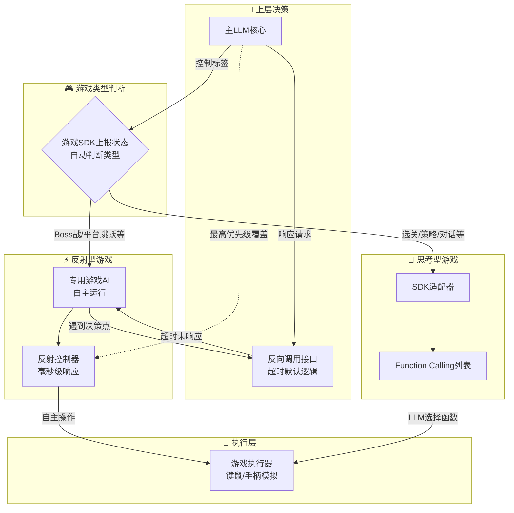
```mermaid
graph TB
    subgraph 上层决策["🧠 上层决策"]
        LLM_Game[主LLM核心]
        GameReverseAPI[反向调用接口<br/>超时默认逻辑]
    end

    subgraph 游戏类型判断["🎮 游戏类型判断"]
        GameTypeSwitch{游戏SDK上报状态<br/>自动判断类型}
    end

    subgraph 反射型游戏["⚡ 反射型游戏"]
        DedicatedAI[专用游戏AI<br/>自主运行]
        ReflexController[反射控制器<br/>毫秒级响应]
    end

    subgraph 思考型游戏["🧠 思考型游戏"]
        SDKAdapter[SDK适配器]
        FunctionList[Function Calling列表]
    end

    subgraph 执行层["🎯 执行层"]
        GameExecutor[游戏执行器<br/>键鼠/手柄模拟]
    end

    LLM_Game -->|控制标签| GameTypeSwitch
    LLM_Game -->|响应请求| GameReverseAPI
    GameTypeSwitch -->|Boss战/平台跳跃等| DedicatedAI
    GameTypeSwitch -->|选关/策略/对话等| SDKAdapter

    DedicatedAI --> ReflexController
    ReflexController -->|自主操作| GameExecutor

    SDKAdapter --> FunctionList
    FunctionList -->|LLM选择函数| GameExecutor

    DedicatedAI -->|遇到决策点| GameReverseAPI
    GameReverseAPI -->|超时未响应| DedicatedAI

    LLM_Game -.->|最高优先级覆盖| ReflexController
```

---

## 第七章：全双工对话与打断机制

### 7.1 打断机制时序

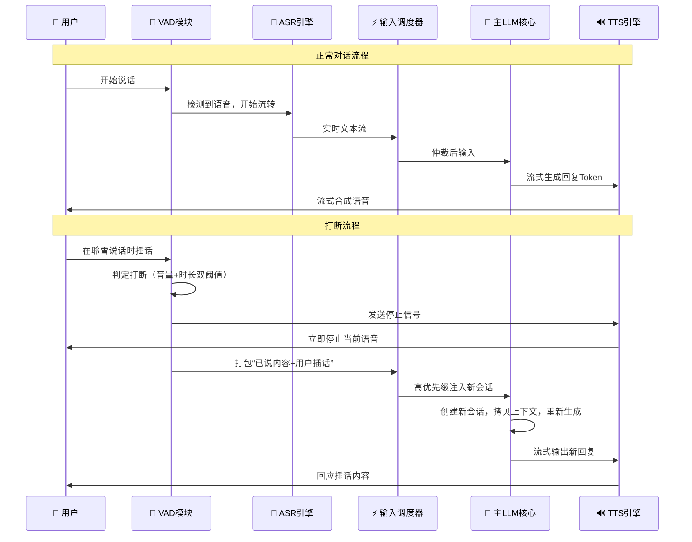
```mermaid
sequenceDiagram
    participant User as 👤 用户
    participant VAD as 🎤 VAD模块
    participant ASR as 📝 ASR引擎
    participant InputSch as ⚡ 输入调度器
    participant LLM as 🧠 主LLM核心
    participant TTS as 🔊 TTS引擎

    Note over User,TTS: 正常对话流程
    User->>VAD: 开始说话
    VAD->>ASR: 检测到语音，开始流转
    ASR->>InputSch: 实时文本流
    InputSch->>LLM: 仲裁后输入
    LLM->>TTS: 流式生成回复Token
    TTS->>User: 流式合成语音

    Note over User,TTS: 打断流程
    User->>VAD: 在聆雪说话时插话
    VAD->>VAD: 判定打断（音量+时长双阈值）
    VAD->>TTS: 发送停止信号
    TTS->>User: 立即停止当前语音
    VAD->>InputSch: 打包“已说内容+用户插话”
    InputSch->>LLM: 高优先级注入新会话
    LLM->>LLM: 创建新会话，拷贝上下文，重新生成
    LLM->>TTS: 流式输出新回复
    TTS->>User: 回应插话内容
```

### 7.2 会话池管理

系统维护固定大小的会话池（默认上限由管理面配置），支持多人同时对话。当会话数达到上限时，新的连接请求将被拒绝并收到错误提示。会话池使用率由健康巡检子模块定期采集，当使用率超过阈值时触发轻微异常告警。

---

## 第八章：多会话并发与一致性保障

### 8.1 单一大脑，多会话并行

聆雪的文本、动作、游戏操作等指令，均由同一个主LLM核心在一次推理中结构化生成，从源头保证多模态输出的一致性。

### 8.2 一致性保障机制

| 机制 | 说明 |
|------|------|
| **同源优先** | 文本和控制标签由同一次LLM推理生成，天然语义对齐 |
| **文本标签最高优先级** | 当文本会话输出了控制标签，调度器自动覆盖其他来源的同类型指令 |
| **一致性校验层** | 检测文本语义与非文本输出是否矛盾，矛盾时丢弃非文本输出 |
| **意图分析兜底** | 当主LLM未输出控制标签时，意图分析器补充控制指令 |

### 8.3 优先级仲裁机制

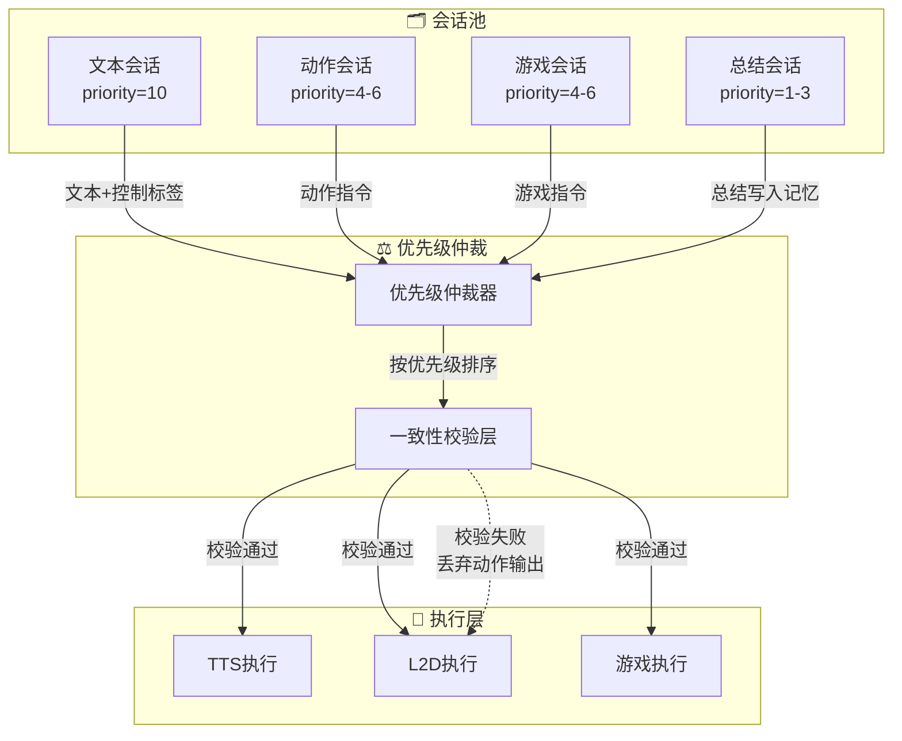
```mermaid
graph TB
    subgraph 会话池["🗂️ 会话池"]
        TextSession[文本会话<br/>priority=10]
        ActionSession[动作会话<br/>priority=4-6]
        GameSession[游戏会话<br/>priority=4-6]
        SummarySession[总结会话<br/>priority=1-3]
    end

    subgraph 优先级仲裁["⚖️ 优先级仲裁"]
        Arbiter[优先级仲裁器]
        ConsistencyCheck[一致性校验层]
    end

    subgraph 执行层["🎯 执行层"]
        TTS_Exec[TTS执行]
        L2D_Exec[L2D执行]
        Game_Exec[游戏执行]
    end

    TextSession -->|文本+控制标签| Arbiter
    ActionSession -->|动作指令| Arbiter
    GameSession -->|游戏指令| Arbiter
    SummarySession -->|总结写入记忆| Arbiter

    Arbiter -->|按优先级排序| ConsistencyCheck
    ConsistencyCheck -->|校验通过| TTS_Exec
    ConsistencyCheck -->|校验通过| L2D_Exec
    ConsistencyCheck -->|校验通过| Game_Exec

    ConsistencyCheck -.->|校验失败<br/>丢弃动作输出| L2D_Exec
```

---

## 第九章：关键交互时序

### 9.1 用户语音指令驱动智能家居

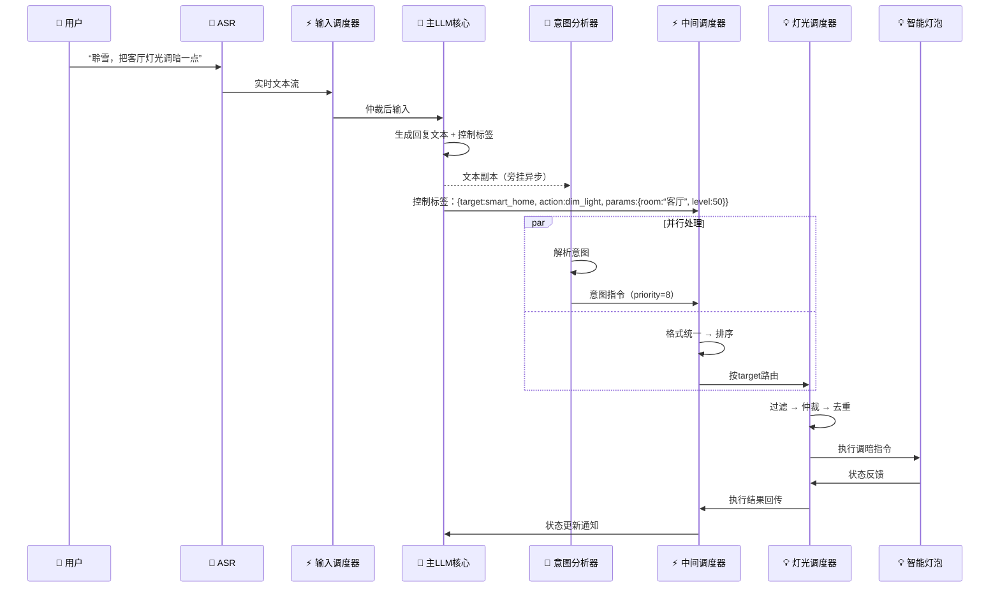
```mermaid
sequenceDiagram
    participant User as 👤 用户
    participant ASR as 🎤 ASR
    participant InputSch as ⚡ 输入调度器
    participant LLM as 🧠 主LLM核心
    participant Intent as 🔗 意图分析器
    participant MidSch as ⚡ 中间调度器
    participant LightSch as 💡 灯光调度器
    participant Light as 💡 智能灯泡

    User->>ASR: “聆雪，把客厅灯光调暗一点”
    ASR->>InputSch: 实时文本流
    InputSch->>LLM: 仲裁后输入
    LLM->>LLM: 生成回复文本 + 控制标签
    LLM-->>Intent: 文本副本（旁挂异步）
    LLM->>MidSch: 控制标签：{target:smart_home, action:dim_light, params:{room:“客厅”, level:50}}

    par 并行处理
        Intent->>Intent: 解析意图
        Intent->>MidSch: 意图指令（priority=8）
    and
        MidSch->>MidSch: 格式统一 → 排序
        MidSch->>LightSch: 按target路由
    end

    LightSch->>LightSch: 过滤 → 仲裁 → 去重
    LightSch->>Light: 执行调暗指令
    Light->>LightSch: 状态反馈
    LightSch->>MidSch: 执行结果回传
    MidSch->>LLM: 状态更新通知
```

### 9.2 游戏场景（反射型游戏）

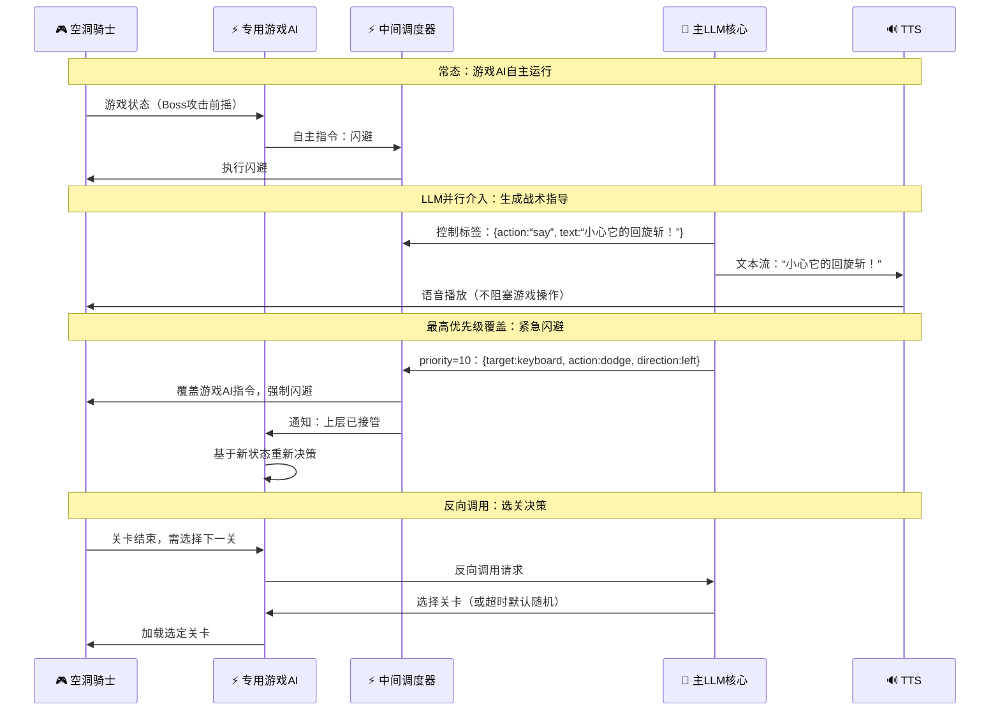
```mermaid
sequenceDiagram
    participant Game as 🎮 空洞骑士
    participant GameAI as ⚡ 专用游戏AI
    participant MidSch as ⚡ 中间调度器
    participant LLM as 🧠 主LLM核心
    participant TTS as 🔊 TTS

    Note over Game,TTS: 常态：游戏AI自主运行
    Game->>GameAI: 游戏状态（Boss攻击前摇）
    GameAI->>MidSch: 自主指令：闪避
    MidSch->>Game: 执行闪避

    Note over Game,TTS: LLM并行介入：生成战术指导
    LLM->>MidSch: 控制标签：{action:“say”, text:“小心它的回旋斩！”}
    LLM->>TTS: 文本流：“小心它的回旋斩！”
    TTS->>Game: 语音播放（不阻塞游戏操作）

    Note over Game,TTS: 最高优先级覆盖：紧急闪避
    LLM->>MidSch: priority=10：{target:keyboard, action:dodge, direction:left}
    MidSch->>Game: 覆盖游戏AI指令，强制闪避
    MidSch->>GameAI: 通知：上层已接管
    GameAI->>GameAI: 基于新状态重新决策

    Note over Game,TTS: 反向调用：选关决策
    Game->>GameAI: 关卡结束，需选择下一关
    GameAI->>LLM: 反向调用请求
    LLM->>GameAI: 选择关卡（或超时默认随机）
    GameAI->>Game: 加载选定关卡
```

---

## 第十章：技术栈选型参考

| 模块 | 推荐技术 | 部署位置 | 备注 |
|------|----------|----------|------|
| 主LLM推理 | oobabooga + LLaMA 3 8B Instruct（量化） | 本地RTX 4090 | 支持流式与结构化输出 |
| 思维子系统LLM | 同上，可复用或使用更轻量模型 | 本地GPU | 多节点复用同一模型实例 |
| TTS | 自训练VITS变体模型 | 本地GPU | 需支持流式合成 |
| ASR | Whisper / Faster-Whisper | 本地/云端 | 需支持实时流转写 |
| L2D | Live2D Cubism SDK + Unity | 本地渲染 | WebSocket接收动作指令 |
| 短期记忆 | Redis | 本地 | 低延迟读写 |
| 长期记忆 | ChromaDB / Milvus | 本地 | 向量检索，支持RAG |
| 设备注册中心 | FastAPI + SQLite | 本地 | RESTful API |
| 能力注册中心 | FastAPI + SQLite | 本地 | 能力清单管理 |
| 中间调度器 | Rust / Go 高性能服务 | 本地 | 低延迟消息路由 |
| 末端调度器 | 嵌入式Python / Go | 嵌入式设备/本地 | 网络通信，独立部署 |
| 异常调度子模块 | Python / Go | 本地 | 异常收集、分级、日志 |
| 健康巡检子模块 | Python | 本地 | 定时任务，指标采集 |
| 管理面API | FastAPI | 本地 | 管理面接口 |
| 数据采集器 | Python | 本地 | 定时拉取，适配聚合 |
| 话题树管理器 | FastAPI + SQLite | 本地 | 话题树结构与权重管理 |
| 监控面板 | React + ECharts | 本地Web | 仪表盘可视化 |
| 设备通信协议 | HTTP / WebSocket / MQTT | 局域网 | 根据设备能力选择 |
| 游戏SDK | Neuro Game SDK（TypeScript/Rust/C#） | 游戏侧集成 | 开源可用 |
| 容器化 | Docker Compose | 本地服务器 | 统一管理所有服务 |

---

## 第十一章：架构扩展性设计

| 扩展场景 | 操作方式 | 核心系统影响 |
|----------|----------|-------------|
| 新增智能家居设备 | 设备实现描述符协议，上电自动注册 | 零改动 |
| 接入新游戏 | 游戏实现SDK，按类型选择专用AI或Function Calling | 零改动 |
| 新增传感器/摄像头 | 设备注册 + 可选虚拟设备组合抽象 | 零改动 |
| 新增基础函数能力 | 通过管理面API注册为MCP插件 | 零改动，能力清单即时更新 |
| 新增话题分类 | 管理面话题树编辑器直接添加节点 | 即时生效，无需重启 |
| 调整话题领域权重 | 管理面话题树管理器调整权重参数 | 下一轮思维周期生效 |
| 多人同时对话 | 管理面调整会话池上限 | 需评估GPU显存余量 |
| 分布式部署 | 末端调度器部署至嵌入式设备 | 仅需网络互通 |
| 新增输出模态 | 新增对应末端调度器，注册路由表 | 核心调度层零改动 |

---

> **文档版本**：v0.4
> **最后更新**：2026年5月29日
> **项目代号**：聆雪 Lucenette
> **设计哲学**：*She listens like snow. She connects like a net.*
> **架构核心**：顶层决策，底层自主；单向控制，末端自治；显意识响应，潜意识思考；能力皆插件，管理不侵入；话题可编排，思维可引导。


## 贡献指南

我们欢迎以下类型的贡献：

- 新的AI角色设计
- 对话质量评估算法
- 安全过滤机制的改进
- 使用案例和文档

## 路线图

1. 支持更多本地AI模型
2. 实现可视化对话图谱
3. 添加用户引导机制
4. 开发API接口

## 许可证

本项目采用 MIT 许可证 - 详见 [LICENSE](./LICENSE) 文件。

**免责声明:**  本项目是学术研究工具，生成内容不代表项目维护者观点。使用者应对生成内容承担全部责任。
