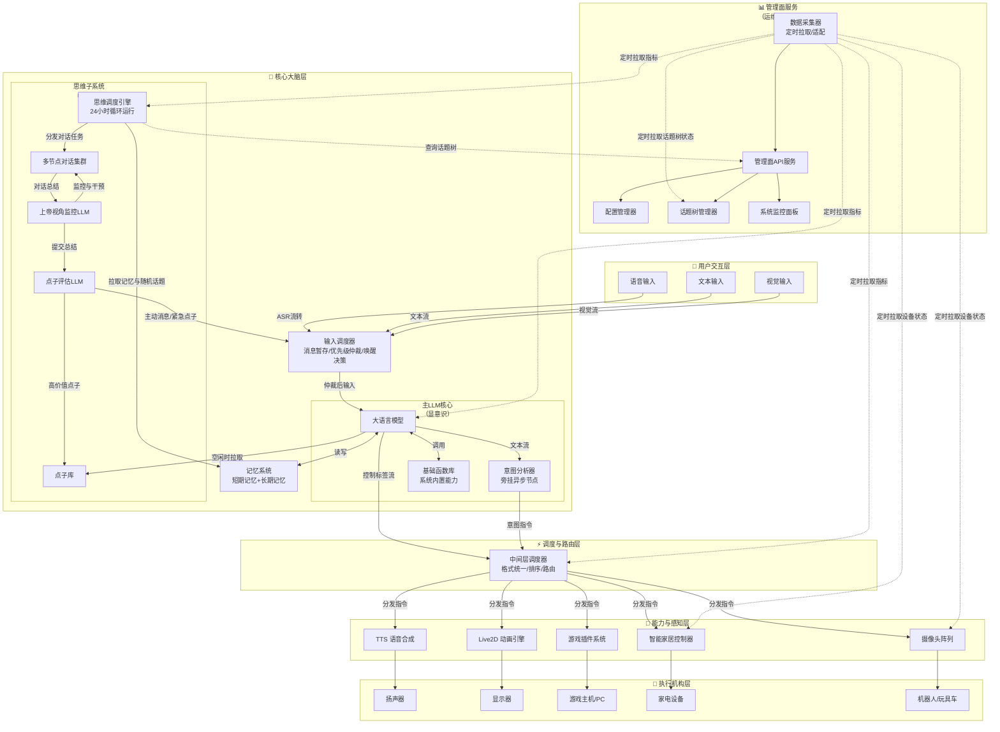

<!--
⚠️ 迁移说明：本文档由原 README.md（v0.4）原样拆分而来，未改动正文内容，仅调整归属（文档体系 v0.5）。
来源：原 README 第一章 + 第十一章。
章节编号暂沿用原 README，细化时统一重排。
-->

# 总体架构概览

## 第一章：总体架构概览

### 1.1 系统定位

聆雪 Lucenette 是一个以大语言模型为核心大脑、以分布式调度网络为神经系统、以即插即用设备抽象为感官与肢体、以管理面服务为运维中枢的**通用智能体操作系统**。其设计目标并非复刻一个简单的聊天机器人，而是构建一个具备**主动思考能力、多模态交互能力、动态环境感知与设备操控能力、自我监控与异常恢复能力**的数字生命系统。

### 1.2 六大系统总览

聆雪的整体架构由六大逻辑系统组成，各自承担独立且明确的职责：

| 系统 | 职责 | 核心原则 |
|------|------|----------|
| **用户交互层** | 接收多模态输入，统一转化为核心大脑可理解的文本流 | 流式处理，边接收边转化 |
| **核心大脑层** | 理解意图、生成回复、输出控制指令、主动思考与点子生成 | LLM只负责生成，不负责判断时机；思维子系统赋予系统主动性 |
| **调度与路由层** | 汇总所有控制指令，按优先级排序，分发至各执行机构 | 做薄做轻，只管路由不管意图 |
| **能力与感知层** | 各专项模块独立运行，自主决策，接受顶层覆盖 | 底层自主，顶层覆盖，单向控制 |
| **执行机构层** | 真正驱动硬件执行动作 | 末端自治，自带调度器，即插即用 |
| **管理面服务** | 统一的能力注册与管理、系统健康监控、异常日志汇聚、话题树动态配置、配置管理 | 定时采集，单向拉取，管理操作不侵入数据面 |

### 1.3 总体架构框图

### 1.4 双核架构：显意识与潜意识

聆雪的核心大脑层采用了独特的**双核架构**，类比人类的认知模型：

| 核心 | 类比 | 运行模式 | 主要职责 |
|------|------|----------|----------|
| **主LLM核心** | 显意识 | 事件驱动，响应外部输入 | 即时交互、指令执行、多模态输出 |
| **思维子系统** | 潜意识/后台思考 | 24小时循环运行，自激振荡 | 信息整理、自由探索、点子生成、主动推送 |

这一设计赋予了聆雪超越传统被动响应式AI的**主动性**——她能够在没有外部输入的情况下，自主地思考、学习、产生灵感，并在合适的时机主动发起对话或执行动作。

---

<!-- ─── 章节分隔（来源不同） ─── -->

## 第十一章：架构扩展性设计

| 扩展场景 | 操作方式 | 核心系统影响 |
|----------|----------|-------------|
| 新增智能家居设备 | 设备实现描述符协议，上电自动注册 | 零改动 |
| 接入新游戏 | 游戏实现SDK，按类型选择专用AI或Function Calling | 零改动 |
| 新增传感器/摄像头 | 设备注册 + 可选虚拟设备组合抽象 | 零改动 |
| 新增基础函数能力 | 通过管理面API注册为MCP插件 | 零改动，能力清单即时更新 |
| 新增话题分类 | 管理面话题树编辑器直接添加节点 | 即时生效，无需重启 |
| 调整话题领域权重 | 管理面话题树管理器调整权重参数 | 下一轮思维周期生效 |
| 多人同时对话 | 管理面调整会话池上限 | 需评估GPU显存余量 |
| 分布式部署 | 末端调度器部署至嵌入式设备 | 仅需网络互通 |
| 新增输出模态 | 新增对应末端调度器，注册路由表 | 核心调度层零改动 |

---

> 📌 **细化清单（待讨论）**
> - 章节编号暂沿用原 README，细化时统一重排；
> - 补充架构演进说明与 ADR 引用。
