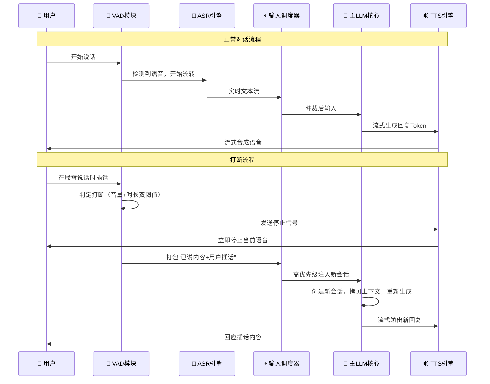

<!--
⚠️ 迁移说明：本文档由原 README.md（v0.4）原样拆分而来，未改动正文内容，仅调整归属（文档体系 v0.5）。
来源：原 README 第七章。
章节编号暂沿用原 README，细化时统一重排。
-->

# 用户交互层（M01）

## 第七章：全双工对话与打断机制

### 7.1 打断机制时序

### 7.2 会话池管理

系统维护固定大小的会话池（默认上限由管理面配置），支持多人同时对话。当会话数达到上限时，新的连接请求将被拒绝并收到错误提示。会话池使用率由健康巡检子模块定期采集，当使用率超过阈值时触发轻微异常告警。

---

> 📌 **细化清单（待讨论）**
> - 待补充：ASR/VAD 流式管线、多模态输入统一；
> - 会话池上限与拒绝策略需量化；
> - 打断判定阈值（音量+时长）需给出具体数值。
