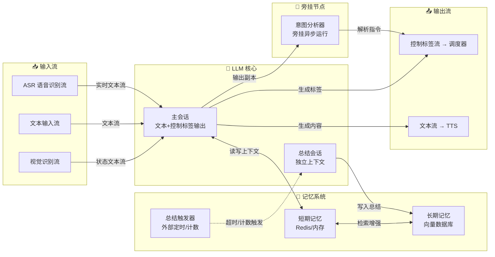
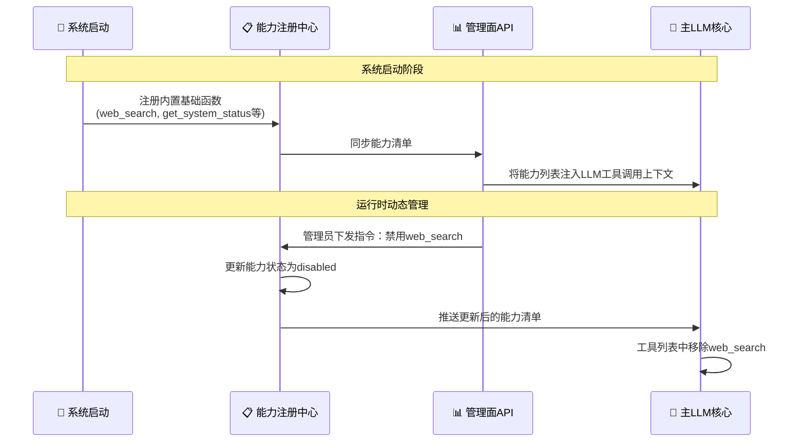
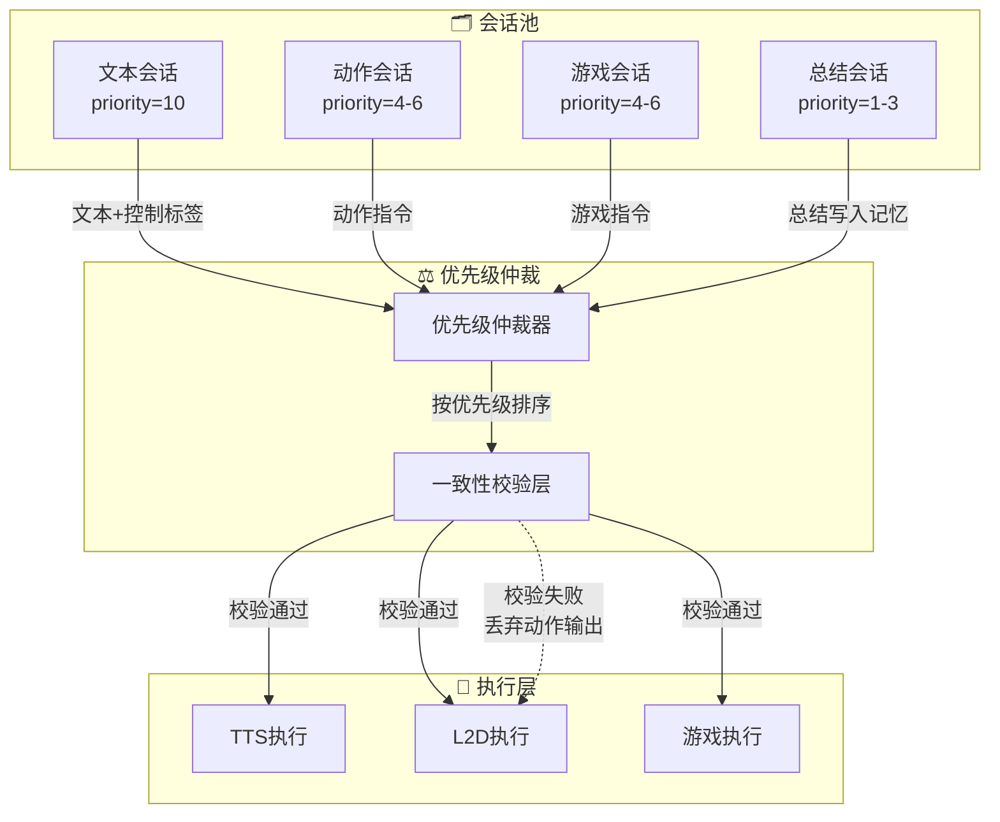

<!--
⚠️ 迁移说明：本文档由原 README.md（v0.4）原样拆分而来，未改动正文内容，仅调整归属（文档体系 v0.5）。
来源：原 README 第二章 2.1–2.2 + 第八章。
章节编号暂沿用原 README，细化时统一重排。
-->

# 主LLM核心（M02）

## 第二章：核心大脑层详细架构

### 2.1 主LLM核心

主LLM核心是聆雪的“显意识”所在，负责处理所有即时交互任务。其核心设计理念是：**单一大脑，结构化输出，旁挂增强**。

#### 2.1.1 结构化输出机制

主LLM在一次推理中同时输出：
- **对话文本**：直接送往TTS进行语音合成
- **控制标签**：结构化的JSON指令，用于控制L2D表情、游戏操作、设备控制等

这种设计从源头保证了“言行一致”——当她用文字表达“开心”时，对应的控制标签会同步驱动L2D引擎展示“开心”的表情，无需外部对齐。

#### 2.1.2 意图分析器（旁挂异步节点）

意图分析器是主LLM核心的旁挂模块。它异步接收主LLM输出的文本副本，从中解析意图，并将解析结果以指令形式注入控制标签流。其核心价值在于：

- **确定性兜底**：LLM可能因概率特性而未输出显式控制标签，意图分析器确保系统仍能从文本中提取意图并转化为控制指令
- **不阻塞主流程**：旁挂异步运行，意图分析的延迟不影响对话文本的流式输出
- **可接受降级**：当意图分析器无法可靠解析意图时，系统接受该边界情况，依赖用户主动重复指令进行修正

#### 2.1.3 总结会话（外部触发）

总结任务不由主LLM自觉执行，而是由外部定时器或对话轮次计数器强制触发。触发后，系统创建独立的总结会话（隔离上下文），将最近的对话历史打包并注入总结指令，获取结果后存入长期记忆。主会话对此过程无感知，仅在下一轮对话时被注入“上次对话核心结论”的摘要。

#### 2.1.4 核心大脑层内部结构

---

### 2.2 基础Function Calling能力体系

#### 2.2.1 设计理念

聆雪作为一个智能体，除了通过即插即用机制接入的物理设备外，还需要一系列**不依赖于物理硬件的基础能力**。这些能力在系统启动时自动注册，遵循“万物皆插件”的原则——即使是最核心的内置能力，也以插件形式注册到管理面服务，支持运行时动态启用/禁用。

#### 2.2.2 能力注册机制

所有能力（无论是系统内置的基础函数，还是外部设备接入的能力）均遵循统一的注册协议。系统启动时，内置能力通过**能力注册中心**自动注册；运行时，可通过管理面服务的API动态注册新的能力服务（使用MCP兼容协议）。管理面服务维护全局能力清单，并提供启用/禁用开关。

#### 2.2.3 基础函数分类

##### 信息获取类

| 函数名 | 功能描述 | 参数 | 返回值 |
|--------|----------|------|--------|
| `web_search` | 互联网搜索 | `query: string` | 结构化搜索结果列表 |
| `get_current_time` | 获取当前时间与时区 | `timezone?: string` | ISO8601时间戳与格式化时间字符串 |
| `get_geolocation` | 获取当前设备地理位置 | 无 | 经纬度、地址描述 |
| `get_weather` | 获取指定位置的天气信息 | `location: string` | 天气状况、温度、湿度、未来预报 |

##### 系统自省类

| 函数名 | 功能描述 | 参数 | 返回值 |
|--------|----------|------|--------|
| `get_system_status` | 读取各子系统运行指标 | `subsystem?: string` | CPU/GPU占用、内存、温度等 |
| `get_active_sessions` | 查询当前活跃会话数与会话池使用率 | 无 | 活跃会话数、会话池容量、使用百分比 |
| `get_device_inventory` | 查询当前在线设备清单 | 无 | 设备ID、类型、在线状态列表 |
| `get_idea_queue_length` | 查询点子库中待处理点子数量 | 无 | 待处理点子数、最旧点子时间戳 |

##### 主动通信类

| 函数名 | 功能描述 | 参数 | 返回值 |
|--------|----------|------|--------|
| `proactive_speak` | 通过TTS主动发起语音对话 | `message: string, urgency: int` | 执行状态 |
| `proactive_notify` | 通过移动端推送通知 | `title: string, body: string, urgency: int` | 执行状态 |

#### 2.2.4 能力开关的应用场景

“万物皆插件、皆可开关”的设计为多样化的交互场景提供了灵活性：

| 场景 | 操作 | 效果 |
|------|------|------|
| 趣味知识竞赛 | 管理面禁用`web_search` | 聆雪只能依靠自身知识回答，无法联网作弊 |
| 隐私模式 | 管理面禁用`get_geolocation` | 位置信息不可获取 |
| 深度思考模式 | 管理面禁用`proactive_speak` | 暂停主动打扰，专注后台思考 |
| 性能保护 | 健康巡检自动禁用高耗能能力 | GPU温度过高时临时关闭某些非必要能力 |

---

<!-- ─── 章节分隔（来源不同） ─── -->

## 第八章：多会话并发与一致性保障

### 8.1 单一大脑，多会话并行

聆雪的文本、动作、游戏操作等指令，均由同一个主LLM核心在一次推理中结构化生成，从源头保证多模态输出的一致性。

### 8.2 一致性保障机制

| 机制 | 说明 |
|------|------|
| **同源优先** | 文本和控制标签由同一次LLM推理生成，天然语义对齐 |
| **文本标签最高优先级** | 当文本会话输出了控制标签，调度器自动覆盖其他来源的同类型指令 |
| **一致性校验层** | 检测文本语义与非文本输出是否矛盾，矛盾时丢弃非文本输出 |
| **意图分析兜底** | 当主LLM未输出控制标签时，意图分析器补充控制指令 |

### 8.3 优先级仲裁机制

---

> 📌 **细化清单（待讨论）**
> - 2.2 能力注册协议细化时抽至 01-contracts/tool-registry.md；
> - 记忆系统相关内容细化时抽至 M04-memory.md；
> - 会话池管理（见 M01 7.2）归属待讨论。
