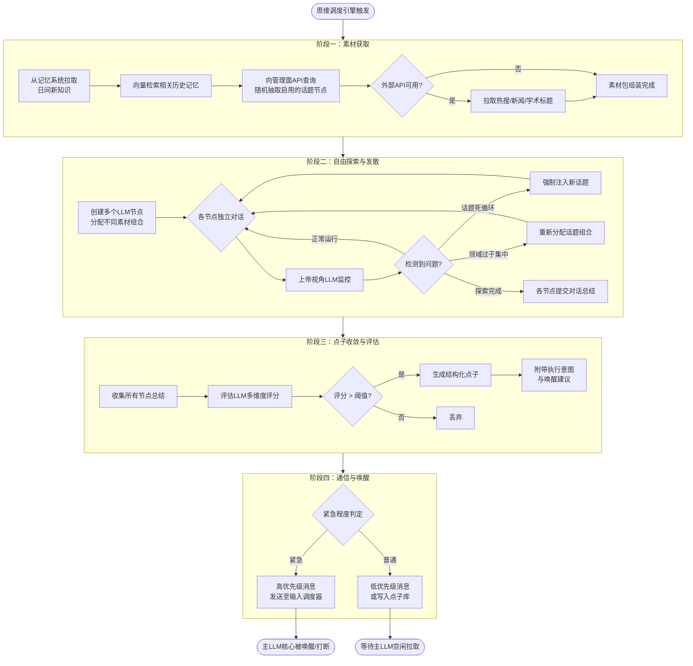
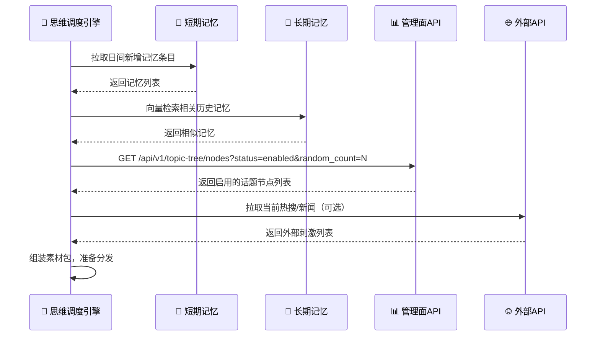
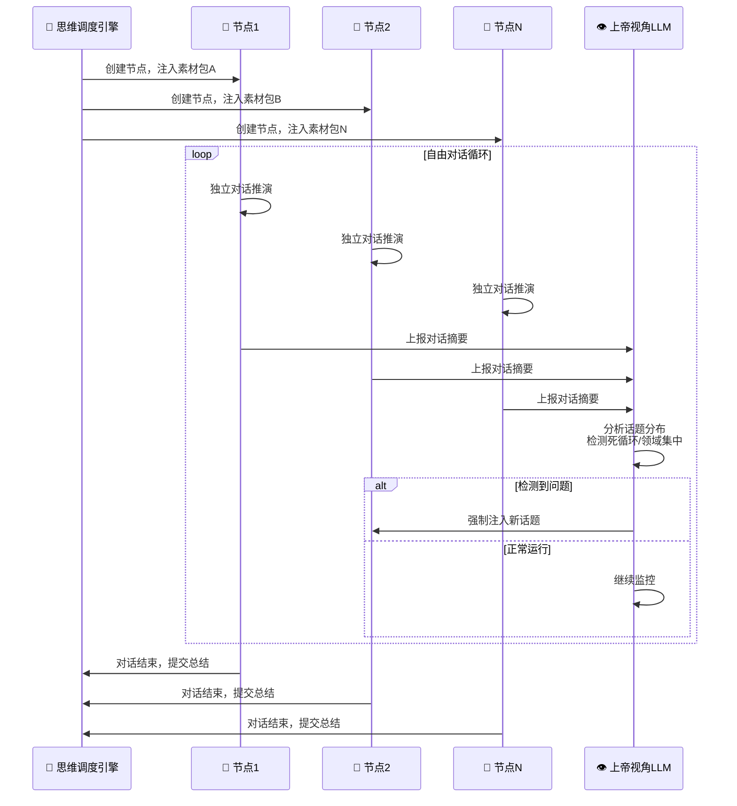
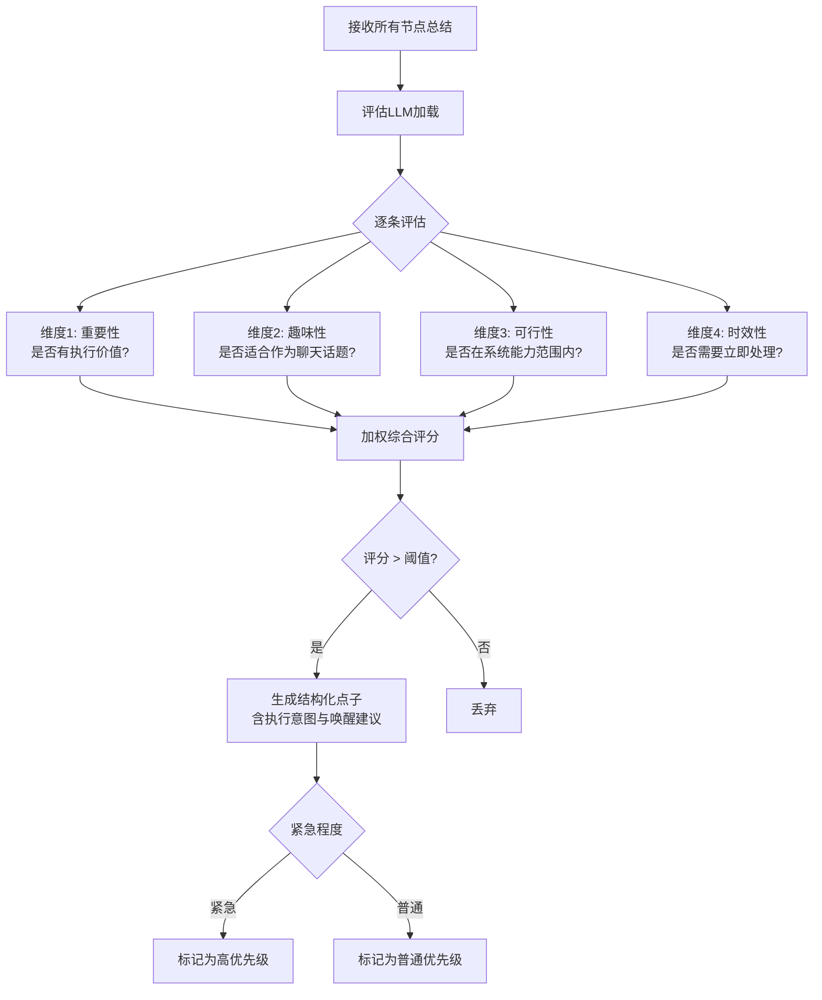
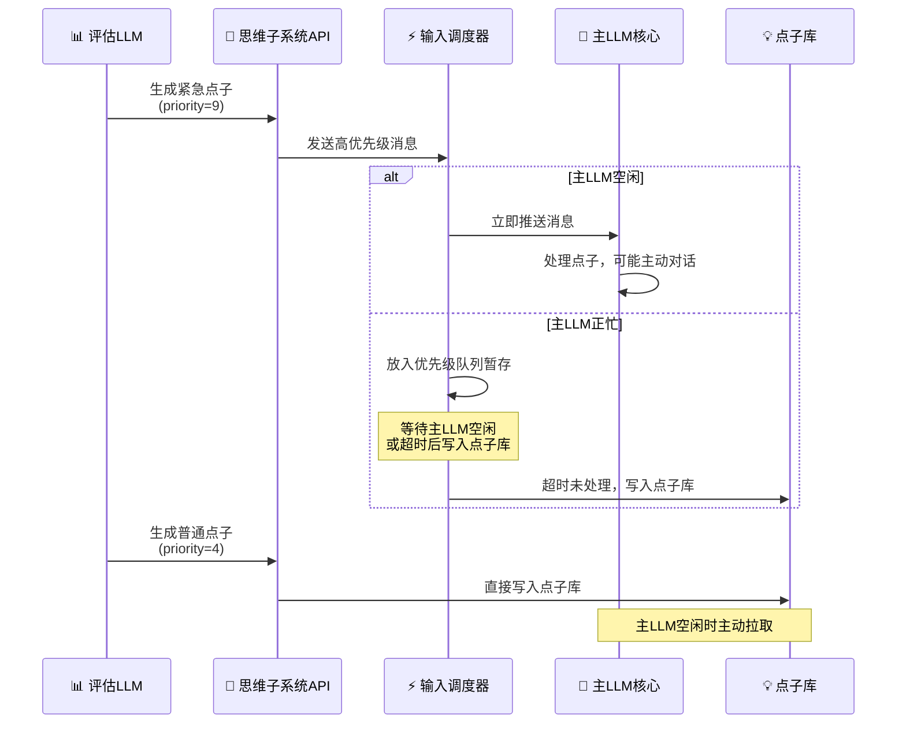
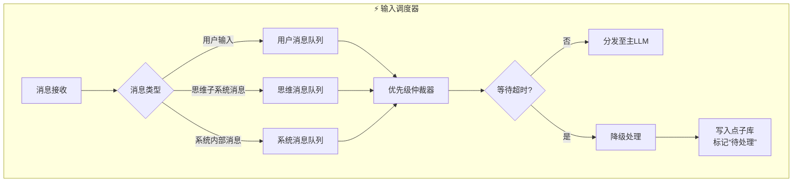

<!--
⚠️ 迁移说明：本文档由原 README.md（v0.4）原样拆分而来，未改动正文内容，仅调整归属（文档体系 v0.5）。
来源：原 README 第二章 2.3。
章节编号暂沿用原 README，细化时统一重排。
-->

# 思维子系统（M03）

### 2.3 思维子系统（潜意识/后台思考引擎）

思维子系统是聆雪“主动性”的灵魂。其设计哲学源于“日有所思，夜有所梦”的认知模型：将日间积累的新知识与随机话题混合，通过多节点对话进行自由探索，从中提炼有价值的“点子”，并在合适时机主动推送给主LLM核心。

#### 2.3.1 设计目标

- **信息整理**：对日间获取的新知识进行归纳、关联与深度加工
- **自由探索**：通过随机话题组合，驱动跨领域的创造性联想
- **点子生成**：从发散性对话中收敛出有执行价值或沟通价值的灵感
- **主动推送**：在恰当的条件下，主动向主LLM核心发送消息，驱动主动行为

#### 2.3.2 工作流程总览

思维子系统的工作流程分为四个标准化阶段，由思维调度引擎统一编排。阶段一负责从记忆系统、管理面话题树、外部API等多源拉取素材并组装为素材包；阶段二将素材包分发至多个隔离上下文的LLM节点进行自由对话推演，期间由上帝视角LLM持续监控话题健康度并在必要时干预；阶段三由评估LLM对各节点提交的对话总结进行多维度评分，筛选出高价值点子；阶段四根据点子的紧急程度决定通信路径——紧急点子通过输入调度器直接推送至主LLM核心，普通点子写入点子库等待空闲拉取。

#### 2.3.3 阶段一：素材获取时序

素材获取是思维子系统的输入环节，决定了本轮“梦境”的探索方向。引擎首先从短期记忆拉取自上一思维周期以来新增的记忆条目，随后以这些条目为锚点在长期记忆中进行向量相似检索，补充历史相关信息。话题素材不再依赖静态配置文件，而是通过管理面API实时查询启用的话题节点，管理面根据配置的权重随机抽取并返回。若外部API可用（如联网热搜、学术预印本标题），引擎还可拉取外部刺激以增强素材的时效性和多样性。所有素材最终组装为统一的素材包，等待分发至对话节点。

#### 2.3.4 阶段二：多节点并行对话与上帝视角监控

阶段二是思维子系统的核心推演环节。调度引擎根据素材包数量创建对应数量的LLM节点，每个节点拥有独立的对话上下文，被注入不同的素材组合（通过随机抽取话题并合并或分发实现）。各节点在隔离环境中并行进行自由对话推演。

上帝视角LLM作为监控节点，拥有纵观所有对话节点的权限。每个节点定期向它上报对话摘要，上帝视角LLM负责分析整体话题分布，检测是否存在话题死循环（某节点连续多轮未切换话题）或领域过度集中（所有节点的话题聚集在少数领域）等问题。一旦检测到异常，上帝视角LLM通过强制注入新话题或重新分配话题组合的方式进行干预。当所有节点完成预设的推演轮次后，各自提交对话总结，进入阶段三。

#### 2.3.5 阶段三：点子评估流程

阶段三负责从发散性对话中收敛出有价值的“点子”。评估LLM对每个节点提交的对话总结进行四维度评分：重要性（是否具有执行价值或决策参考意义）、趣味性（是否适合作为主动聊天话题）、可行性（是否在当前系统能力范围内）、时效性（是否需要立即处理）。四个维度的加权综合评分决定该总结是被转化为结构化点子还是直接丢弃。

通过阈值筛选的点子被封装为包含标题、摘要、评分详情、建议执行意图和唤醒建议的结构化数据。根据综合评分中的时效性维度，点子被进一步标记为“紧急”或“普通”，进入阶段四的差异化通信路径。

#### 2.3.6 阶段四：通信与唤醒时序

阶段四负责将评估后的点子送达主LLM核心，其通信路径根据紧急程度差异化处理。紧急点子通过思维子系统API以高优先级消息的形式直接发送至输入调度器。输入调度器根据主LLM核心的当前状态决定立即推送还是暂存队列；若在队列中等待超时（默认5分钟），消息自动降级写入点子库并标记“待处理”，模拟人类“灵光乍现但稍纵即逝”的认知过程。

普通点子不经过输入调度器，直接写入点子库。主LLM核心在空闲时主动拉取点子库中的待处理条目，根据人设性格和当前场景决定是否发起主动对话或执行建议的动作。这一差异化设计确保了紧急灵感能够即时传递，同时避免了普通点子对正在进行的用户交互造成不必要的打断。

#### 2.3.7 话题树系统

思维子系统的话题树由**管理面服务动态管理**，而非静态配置文件。话题树的多级分类结构、各节点的启用状态、领域权重等均存储在管理面数据库中。思维调度引擎在每轮周期的阶段一中，通过管理面API实时查询启用的话题节点。管理面提供话题树的可视化编辑界面，支持运行时增删节点、批量启用/禁用、调整领域权重，变更即时生效，下一轮思维周期自动应用新配置。

**随机组合策略**：

| 策略名称 | 操作方式 | 目的 |
|----------|----------|------|
| **多话题合并** | 随机抽取多个话题节点，合并为同一提示词，注入同一对话节点 | 强制跨领域关联，催生创造性联想 |
| **多话题分发** | 随机抽取不同话题，分别注入不同对话节点 | 增加思维广度，多方向并行探索 |
| **加权抽取** | 根据近期对话中涉及的话题频率，反向加权抽取 | 防止思维固化，鼓励探索新领域 |

话题树覆盖的一级领域包括：自然科学、人文历史与社会科学、艺术与创作、技术与工程、生活实用、休闲与娱乐、情感心理与性、猎奇玄学与脑洞、职场与学业、时事与公共议题等，每个一级领域下细分至三级子类，总节点数逾千。

#### 2.3.8 输入调度器

输入调度器是连接思维子系统（潜意识）与主LLM核心（显意识）的关键组件，其职责如下：

**核心功能**：

1. **消息暂存**：当主LLM正忙时，来自思维子系统的消息放入优先级队列暂存
2. **超时记录**：消息在队列中等待超时（默认5分钟）后，自动写入点子库，标记为“待处理”
3. **唤醒决策**：主LLM空闲时，从队列和点子库中拉取消息，根据优先级和时效性决定是否立即发起主动对话
4. **强制唤醒**：对于标记为“紧急”的消息，无论主LLM当前状态如何，强制中断当前任务并推送

#### 2.3.9 “睡眠”与“唤醒”功能

基于双核架构，“睡眠”与“唤醒”功能的实现极为自然：

**入睡流程**：
1. 用户发出“睡觉”指令，或触发预设的入睡条件
2. 主LLM核心进入静默模式，切断所有对外主动输出，但保持内部接口畅通
3. L2D引擎切换到预设的“睡眠”动画状态
4. 思维子系统照常运行，非紧急点子全部自动写入点子库

**唤醒条件**：

| 唤醒类型 | 触发条件 | 优先级 |
|----------|----------|--------|
| 内部紧急唤醒 | 思维子系统生成紧急级别点子 | 高 |
| 时间唤醒 | 到达用户预设的起床时间 | 中 |
| 环境唤醒 | 传感器检测到异常（烟雾、门窗异常开启等） | 高 |
| 用户唤醒 | 用户主动语音指令“聆雪，起床了” | 最高 |
| 外部事件唤醒 | 预设的智能家居事件或日程提醒 | 中 |

**醒后行为**：
主LLM核心被唤醒后，首先拉取点子库和消息队列中的待处理消息，根据人设性格，可能主动向用户问候并分享夜间产生的灵感。

---

> 📌 **细化清单（待讨论）**
> - 输入调度器消息包络契约细化时抽至 01-contracts/message-envelope.md；
> - 上帝视角LLM的干预算法需给出可执行规则；
> - 点子库数据结构与生命周期需定义。
