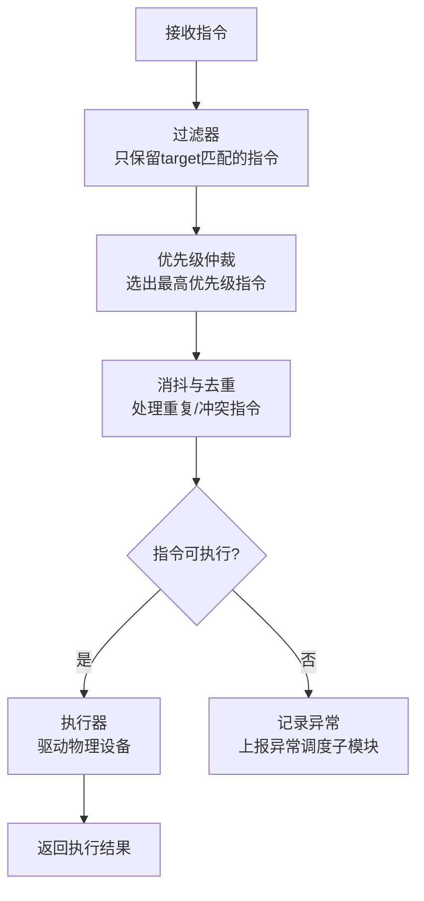
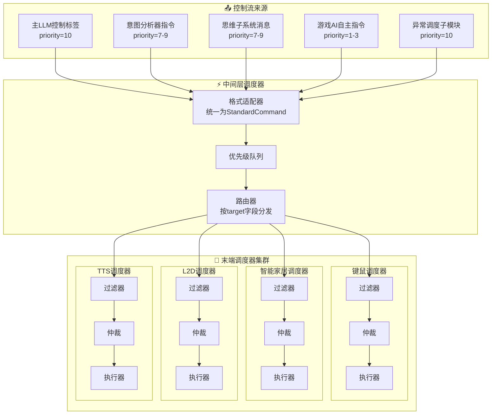

<!--
⚠️ 迁移说明：本文档由原 README.md（v0.4）原样拆分而来，未改动正文内容，仅调整归属（文档体系 v0.5）。
来源：原 README 第三章 3.1–3.4。
章节编号暂沿用原 README，细化时统一重排。
-->

# 调度与路由层（M05）

## 第三章：调度与路由层详细架构

### 3.1 设计哲学

调度层是聆雪的“神经系统”。它采用**分层末端自治**的架构，每个执行单元自带调度器，中间层仅做汇总和透传。核心优势包括：

- **降低中心复杂度**：中间调度器不做意图理解，只做格式化和路由
- **提升扩展性**：新增设备仅需新增对应的末端调度器，无需修改核心代码
- **故障隔离**：某个末端调度器故障不影响其他模块正常运行
- **物理部署灵活性**：末端调度器可部署在嵌入式设备上，与核心节点通过网络通信

### 3.2 中间层调度器

中间层调度器的职责极为精简：

1. **格式适配**：将来自不同来源的控制指令统一转换为标准指令格式
2. **优先级排序**：按指令携带的优先级字段进行排序
3. **路由分发**：根据指令的`target`字段，将指令路由至对应的末端调度器

### 3.3 末端调度器

每个执行机构配备专属的末端调度器，其标准工作流为：

### 3.4 分层调度架构

---

> 📌 **细化清单（待讨论）**
> - 3.5 统一指令格式与 3.6 优先级体系已移至 [01-contracts/standard-command.md](../../01-contracts/standard-command.md)；
> - 需补充 StandardCommand 的 JSON Schema 与路由表定义；
> - 相关交互时序：智能家居见 M06-smart-home.md，游戏见 M06-game-plugin.md。
