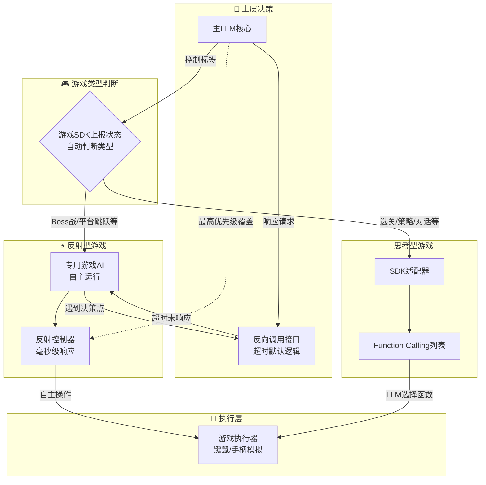
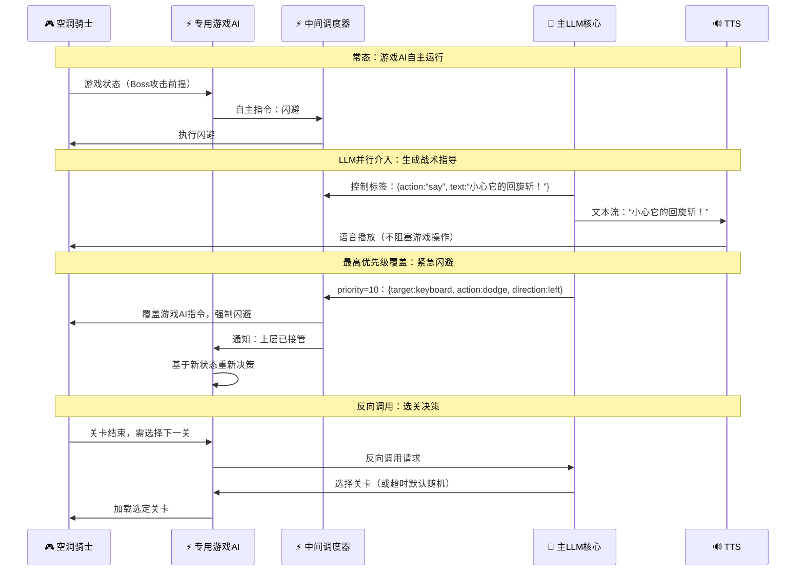

<!--
⚠️ 迁移说明：本文档由原 README.md（v0.4）原样拆分而来，未改动正文内容，仅调整归属（文档体系 v0.5）。
来源：原 README 第六章 + 第九章 9.2。
章节编号暂沿用原 README，细化时统一重排。
-->

# 游戏插件系统（M06-game-plugin）

## 第六章：游戏插件系统详细架构

### 6.1 双模式自适应策略

| 游戏类型 | 特征 | 控制路径 | 典型游戏 |
|----------|------|----------|----------|
| **反射型游戏** | 需要毫秒级响应，高频操作 | 专用游戏AI自主运行 + LLM宏观决策 | OSU!、空洞骑士、赛博朋克2077 |
| **思考型游戏** | 不需要实时响应，可从容决策 | LLM通过Function Calling直接操作 | 猜词游戏、策略游戏、文字冒险 |

### 6.2 游戏插件系统架构

---

<!-- ─── 章节分隔（来源不同） ─── -->

### 9.2 游戏场景（反射型游戏）

---

> 📌 **细化清单（待讨论）**
> - Neuro Game SDK 集成细节待补充；
> - 思考型游戏的 Function Calling 列表需枚举。
