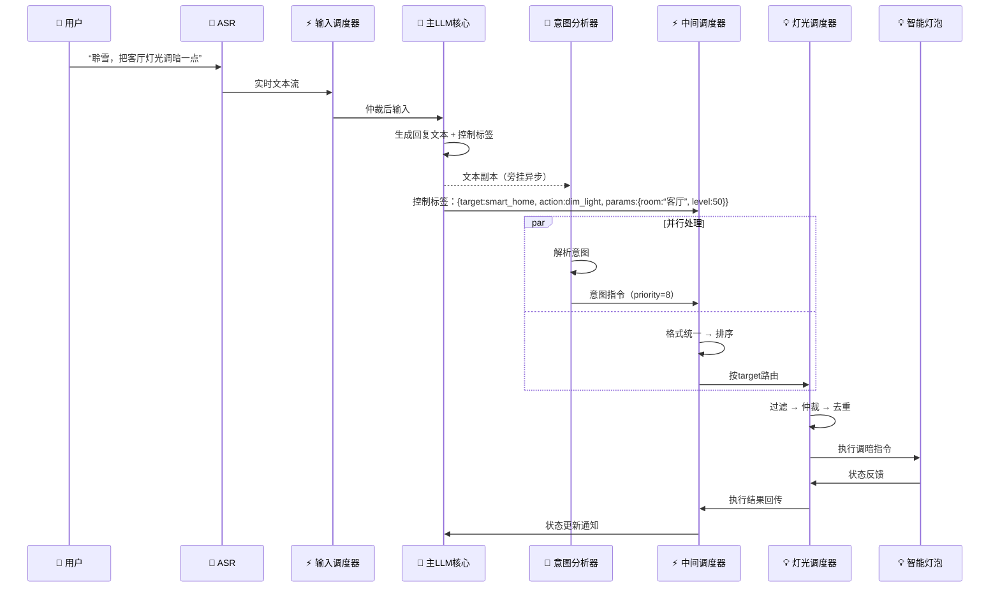

<!--
⚠️ 迁移说明：本文档由原 README.md（v0.4）原样拆分而来，未改动正文内容，仅调整归属（文档体系 v0.5）。
来源：原 README 第九章 9.1（含第九章标题）。
章节编号暂沿用原 README，细化时统一重排。
-->

# 智能家居控制器（M06-smart-home）

## 第九章：关键交互时序

### 9.1 用户语音指令驱动智能家居

---

> 📌 **细化清单（待讨论）**
> - 设备发现/心跳机制待设计；
> - 命令集与虚拟设备组合抽象见 [01-contracts/device-descriptor.md](../../01-contracts/device-descriptor.md)；
> - 第九章 9.2 见 M06-game-plugin.md。
