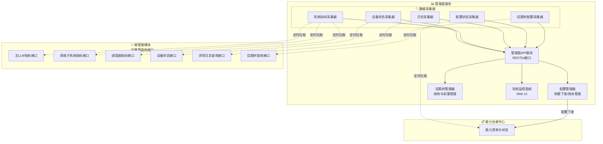
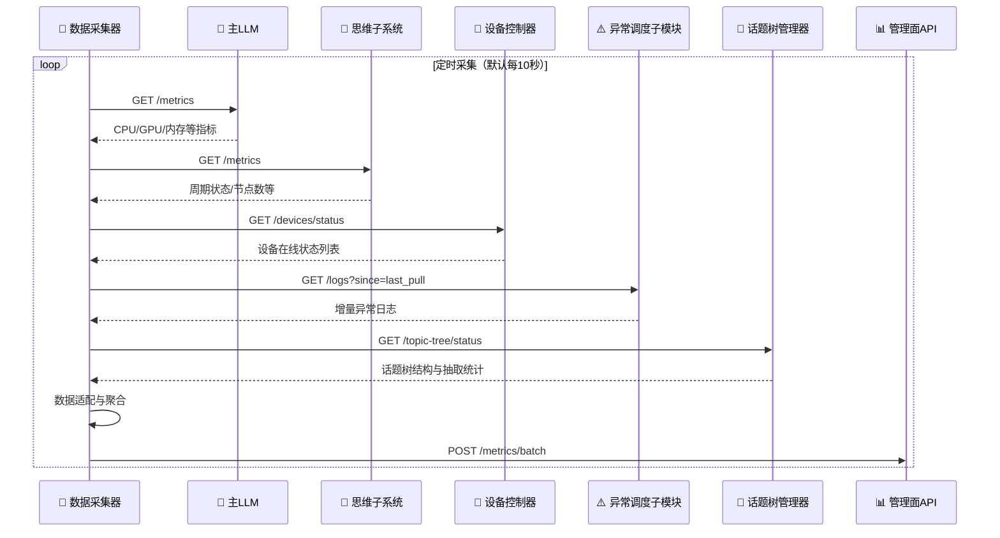

<!--
⚠️ 迁移说明：本文档由原 README.md（v0.4）原样拆分而来，未改动正文内容，仅调整归属（文档体系 v0.5）。
来源：原 README 第五章。
章节编号暂沿用原 README，细化时统一重排。
-->

# 管理面服务（M08）

## 第五章：管理面服务

### 5.1 设计定位

管理面服务是聆雪的**运维管理平面**（Management Plane），与控制流、数据流严格分离。它不介入实时交互链路，仅通过**定时采集**的方式拉取各子模块的状态数据，确保管理操作不会对聆雪的正常运行造成任何性能影响。

### 5.2 设计原则

- **单向采集，避免耦合**：管理面服务下属的数据采集器主动拉取各子模块暴露的指标接口，子模块无需主动上报，无需感知管理面的存在
- **万物皆注册，皆可开关**：所有能力（物理设备、内置函数、动态加载的MCP插件）均在管理面统一注册，支持运行时启用/禁用
- **配置集中管理**：系统核心参数通过管理面统一下发，子模块仅需暴露配置更新接口
- **话题树动态可配**：思维子系统的话题树结构、节点启用状态、领域权重均通过管理面实时管理，无需重启

### 5.3 管理面服务架构

### 5.4 管理面核心功能

#### 5.4.1 话题树管理

- 可视化展示当前话题树的完整多级结构
- 支持增删话题节点、批量启用/禁用
- 支持调整各一级领域的抽取权重
- 展示近期各节点被抽取的频率统计
- 变更即时生效，无需重启思维子系统

#### 5.4.2 设备与能力清单视图

- 展示所有已注册的即插即用物理设备及其在线状态、能力描述符
- 展示所有已注册的Function Calling能力（含系统内置能力与动态加载的MCP插件）
- 支持对任意能力的**启用/禁用**操作，变更即时生效

#### 5.4.3 系统负荷与健康监控

- 实时CPU/GPU利用率、显存占用、内存使用、温度等核心指标仪表盘
- 当前活跃会话数、会话池使用率、点子库积压量、思维子系统周期状态
- 历史趋势图表，便于发现资源泄漏或性能退化

#### 5.4.4 异常与日志中心

- 汇聚异常调度子模块产生的所有异常记录，支持按级别、来源模块、时间筛选
- 系统运行日志的集中存储与检索接口
- 支持为特定级别的异常设置自动推送通知策略

#### 5.4.5 配置管理

- 系统核心参数的集中配置界面（会话池上限、思维周期频率、异常阈值等）
- 支持导出/导入配置文件，便于备份与迁移
- 配置变更记录版本历史，支持回滚

### 5.5 数据采集器工作流程

延续整个系统“单向控制”的设计思路，数据采集器采用**定时拉取**模式，各子模块仅需暴露标准化的数据查询接口，无需感知采集器的存在。

---

> 📌 **细化清单（待讨论）**
> - API 契约细化时抽至 01-contracts/mgmt-api.md；
> - 采集器适配器清单需枚举；
> - Dashboard 页面清单待设计。
