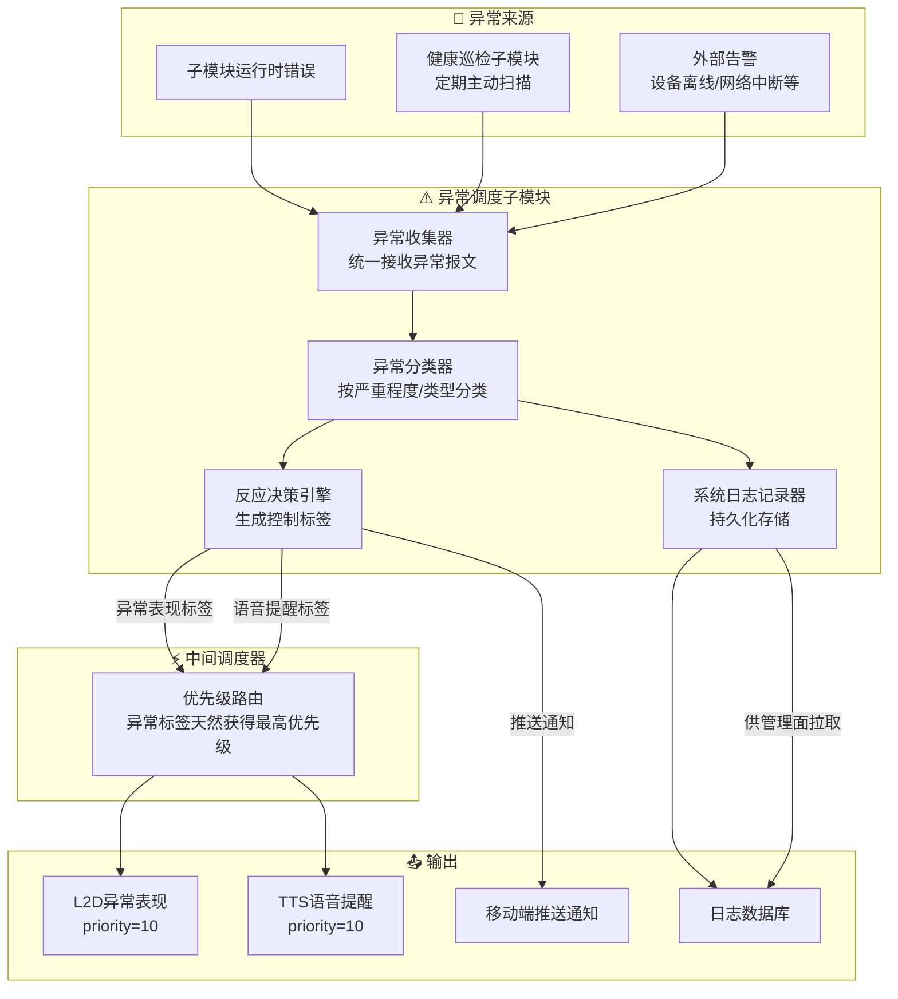
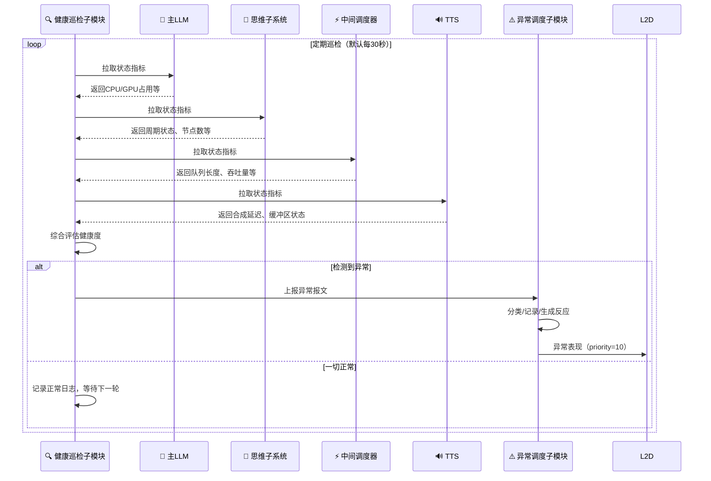

<!--
⚠️ 迁移说明：本文档由原 README.md（v0.4）原样拆分而来，未改动正文内容，仅调整归属（文档体系 v0.5）。
来源：原 README 第四章。
章节编号暂沿用原 README，细化时统一重排。
-->

# 异常处理与健康巡检子系统（M09）

## 第四章：异常处理与健康巡检子系统

### 4.1 设计目标

复杂分布式系统的核心风险在于：任一子模块的故障都可能导致不可预测的级联行为。异常处理与健康巡检子系统是聆雪的“免疫系统”，负责：

- **统一异常收集**：各子模块仅需上报异常，不负责处理异常
- **分级响应**：根据异常严重程度，触发不同级别的拟人化表现或通知
- **主动巡检**：定期扫描各子系统健康状态，在异常发生前预警
- **日志持久化**：所有异常记录统一存储，支持事后排查

### 4.2 子系统架构

### 4.3 异常分级与对应表现

| 级别 | 触发条件示例 | L2D表现 | 语音/通知 | 用户感知 |
|------|------------|---------|-----------|----------|
| **轻微** | GPU占用>90%、单模块响应延迟>3s | “脸红”/“发热”表情 | 主动语音：“我有点热” | 拟人化轻微不适 |
| **中等** | 某模块连续3次报错、设备离线 | “印堂发黑”/“皱眉” | 语音告知具体问题 | 明确的问题提示 |
| **严重** | 核心模块崩溃、LLM推理连续失败 | “晕厥”/“故障”动画 | 推送通知用户，尝试自动恢复 | 立即通知，需关注 |
| **致命** | 系统无法自恢复 | 最小核心存活模式 | 全渠道通知 | 需立即人工干预 |

### 4.4 健康巡检子模块工作流程

---

> 📌 **细化清单（待讨论）**
> - 指标接口契约细化时抽至 01-contracts/metrics-api.md；
> - 异常分级需给出可观测的量化阈值。
